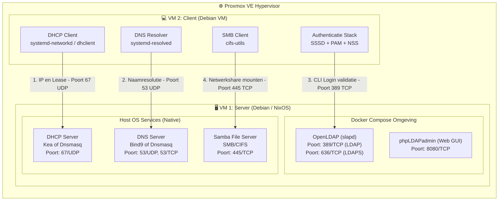

# Systeemarchitectuur & Service-indeling

Dit document beschrijft de componenten van het lab, waar elke service draait (Host OS vs. Docker container vs. Client), en via welke poorten en protocollen de communicatie verloopt.

---

## 🗺️ Overzicht: Wat draait waar?



---

## 📋 Detailoverzicht per Machine

### 1. 🖥️ VM 1: Netwerk Server (NixOS)

De centrale server verzorgt netwerkbeheer, opslag en authenticatie.

| Component / Service | Type | Poort(en) | Functie |
| :--- | :--- | :--- | :--- |
| **DHCP** (Dnsmasq) | Native Service | `67/UDP` (Server)<br>`68/UDP` (Client) | Deelt dynamisch IP-adressen, subnetmasker, gateway en DNS-servers uit aan clients. |
| **DNS** (Dnsmasq) | Native Service | `53/UDP`, `53/TCP` | Vertaalt hostnames naar IP-adressen binnen het lab-domein. |
| **SMB** (Samba) | Native Service | `445/TCP` | Biedt gedeelde netwerkmappen (shares) aan voor clients. |
| **OpenLDAP** (`slapd`) | **Docker Container** | `389/TCP` (LDAP)<br>`636/TCP` (LDAPS) | Centrale database met gebruikersaccounts, groepen en wachtwoord-hashes. |
| **phpLDAPadmin** *(optioneel)* | **Docker Container** | `8080/TCP` (Web) | Webinterface om eenvoudig gebruikers, OU's en groepen in LDAP te beheren. |

---

### 2. 💻 VM 2: Netwerk Client (Debian 13 VM)

Een volwaardige Debian VM die demonstreert dat alle serverdiensten correct functioneren.

| Component / Client Tool | Type | Doel / Rol |
| :--- | :--- | :--- |
| **DHCP Client** | Native (`dhclient` / `systemd-networkd`) | Haalt bij het opstarten automatisch een IP-adres en DNS-server op van VM 1. |
| **DNS Resolver** | Native (`systemd-resolved` / `/etc/resolv.conf`) | Stuurt alle DNS-aanvragen door naar het IP-adres van VM 1. |
| **SSSD / PAM / NSS** | Native (`sssd`, `libpam-sss`, `libnss-sss`) | Zorgt dat gebruikers via de CLI kunnen inloggen met hun LDAP-gebruikersnaam en wachtwoord. |
| **SMB Client Tools** | Native (`cifs-utils`, `smbclient`) | Mount de Samba-shares van VM 1 naar lokale mappen (bijv. `/mnt/share`). |

---

## 🛡️ Beveiliging & Firewall (Network & OS Security)

De scheiding tussen services maakt het instellen van firewall-regels zeer overzichtelijk:

```
                  [ Inkomend Netwerkverkeer ]
                              │
                              ▼
  ┌────────────────────────────────────────────────────────┐
  │ 1. Proxmox VE Firewall (Hypervisor-niveau)             │
  │    - Filtert op vnet/tap interface vóór de VM          │
  │    - Regels: Drop all behalve poorten 53, 67, 389, 445 │
  └───────────────────────────┬────────────────────────────┘
                              │
                              ▼
  ┌────────────────────────────────────────────────────────┐
  │ 2. Host-Level Firewall (Binnen de VM: nftables / UFW)  │
  │    - Beschermt de host en beheert Docker-poorten       │
  └────────────────────────────────────────────────────────┘
```

1. **Toegestane inkomende poorten op de Server VM:**
   * `67/UDP`: DHCP verzoeken van de client.
   * `53/UDP & 53/TCP`: DNS lookups.
   * `389/TCP` (of `636/TCP`): LDAP authenticatieverzoeken vanuit SSSD.
   * `445/TCP`: Samba bestandsoverdracht.
   * `22/TCP`: SSH beheer (optioneel, vanaf beheer-IP).
2. **Afgeschermde poorten:**
   * Poort `8080` (phpLDAPadmin) alleen toegankelijk maken vanaf je beheer-werkstation, niet vanaf de client VM.
   * Alle overige ongeautoriseerde poorten worden gedropt.

---

## 🧪 Verificatie & Testen

Voor gedetailleerde instructies over hoe je alle services vanaf de Debian 13 client test, zie de [Debian 13 Client VM Test- en Verificatiehandleiding](DEBIAN_CLIENT_TESTING_GUIDE.md).

