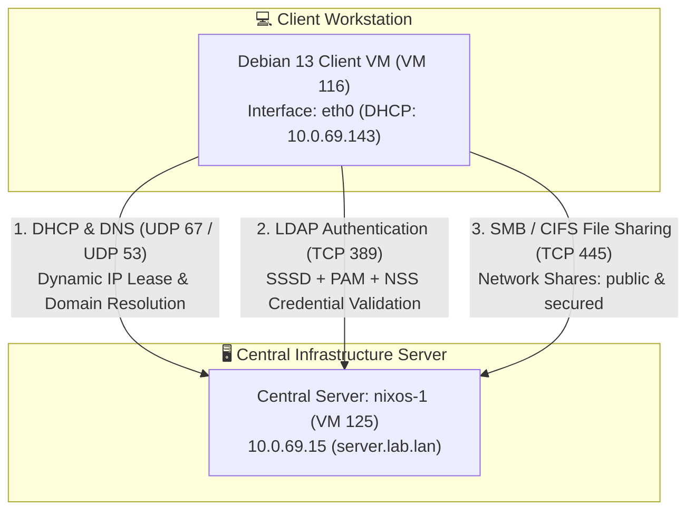

# Debian 13 Client Setup & Configuration Documentation

> **Host:** `debian-1` (`client.lab.lan`)  
> **Operating System:** Debian GNU/Linux 13 (Trixie)  
> **Hypervisor Placement:** Proxmox VE (Node `pve05`, VM ID: 116)  
> **Network Interface:** `eth0` (Connected to SDN Zone `10.0.69.0/24`)  
> **Role:** Dependent client workstation validating central services (DHCP, DNS, OpenLDAP, PAM/SSSD, SMB/CIFS)

---

## 1. System Overview & Architecture

The Debian 13 client is configured as an unprivileged, central-service-dependent workstation. The host maintains no local user accounts for lab members and delegates all identity resolution, credential validation, dynamic network configuration, and network storage access to the central server (`nixos-1` / `10.0.69.15`).



---

## 2. Package Installation

The following system packages were installed on the Debian 13 system:

```bash
apt update && apt install -y \
  isc-dhcp-client \
  dnsutils \
  iputils-ping \
  curl \
  nmap \
  sssd \
  sssd-ldap \
  libpam-sss \
  libnss-sss \
  ldap-utils \
  libpam-modules \
  cifs-utils \
  smbclient
```

---

## 3. Network Configuration (`eth0` via Cloud-Init)

The primary network interface `eth0` is provisioned through **Proxmox VE Cloud-Init** set to **DHCP** for dynamic address allocation.

### 3.1 Cloud-Init Network Provisioning
Within the Proxmox VM configuration (**VM 116 -> Cloud-Init**), the network device is set to:
* **IPv4:** `DHCP`
* **IPv6:** `Disabled` (or `None`)

At VM boot, the `cloud-init` service provisions the network configuration (rendered to `/etc/network/interfaces.d/50-cloud-init`):
```ini
# Generated by Cloud-Init
auto lo
iface lo inet loopback

auto eth0
iface eth0 inet dhcp
```

### 3.2 Network Resolution Parameters
Upon boot, the interface requests an IP lease from the central Dnsmasq DHCP server (`nixos-1`). The lease automatically configures the network stack and populates `/etc/resolv.conf`:
```text
nameserver 10.0.69.15
search lab.lan
```

* **Leased IP Address:** `10.0.69.143/24` (assigned from dynamic range `10.0.69.100` – `10.0.69.200`)
* **Default Gateway:** `10.0.69.1` (Proxmox SDN gateway with SNAT)
* **DNS Nameserver:** `10.0.69.15` (`server.lab.lan`)

---

## 4. Central Authentication Stack (OpenLDAP via SSSD & NSS)

Centralized identity and authentication are managed through **SSSD** (System Security Services Daemon) querying the OpenLDAP container on `server.lab.lan`.

### 4.1 SSSD Configuration (`/etc/sssd/sssd.conf`)

The configuration connects to LDAP over port 389, authenticates using the dedicated read-only service account, and maps POSIX attributes:

```ini
[sssd]
services = nss, pam
domains = lab.lan
config_file_version = 2

[domain/lab.lan]
id_provider = ldap
auth_provider = ldap
chpass_provider = ldap

# LDAP Server Endpoint
ldap_uri = ldap://server.lab.lan:389
ldap_search_base = dc=lab,dc=lan

# Service Bind Account
ldap_default_bind_dn = cn=readonly,dc=lab,dc=lan
ldap_default_authtok = readonlypassword

# Search Bases
ldap_user_search_base = ou=people,dc=lab,dc=lan
ldap_group_search_base = ou=groups,dc=lab,dc=lan

# Schema Mappings (RFC 2307 / POSIX)
ldap_user_object_class = posixAccount
ldap_user_name = uid
ldap_user_home_directory = homeDirectory
ldap_user_shell = loginShell

ldap_group_object_class = posixGroup
ldap_group_member = memberUid

# Security & Lab Environment Flags
ldap_id_use_start_tls = false
ldap_auth_disable_tls_never_use_in_production = true
ldap_tls_reqcert = never

# Direct POSIX UID/GID Mapping (No SID translation)
ldap_id_mapping = false

# Cache Settings
cache_credentials = true
enumerate = true
```

### 4.2 Security Permissions & Service Activation
SSSD rejects configurations that are readable by non-root users:
```bash
chmod 600 /etc/sssd/sssd.conf
chown root:root /etc/sssd/sssd.conf
systemctl restart sssd
systemctl enable sssd
```

### 4.3 Name Service Switch Configuration (`/etc/nsswitch.conf`)
The `sss` module is registered to handle `passwd` and `group` resolution:
```text
passwd:         files systemd sss
group:          files [SUCCESS=merge] systemd sss
shadow:         files sss
gshadow:        files
```

*Verification:* Running `getent passwd user1` resolves directly to:
```text
user1:*:10001:10001:User One:/home/user1:/bin/bash
```

---

## 5. PAM Integration & Automatic Home Directory Creation

To allow directory users (`user1`, `user2`) to log in via CLI/SSH without manual home folder pre-provisioning, PAM is configured with the `pam_mkhomedir` module.

### 5.1 Activation
The module was activated using Debian's PAM authentication updater:
```bash
pam-auth-update --enable mkhomedir
```

### 5.2 Common Session Configuration (`/etc/pam.d/common-session`)
This inserts the following rule into the session management stack:
```text
session required pam_mkhomedir.so skel=/etc/skel/ umask=0077
```

### 5.3 Behavior
Upon initial login (`su - user1` or SSH):
1. PAM authenticates the password against OpenLDAP via `pam_sss.so`.
2. `pam_mkhomedir.so` checks if `/home/user1` exists.
3. If absent, it creates `/home/user1` using skeleton templates from `/etc/skel`, setting owner and group to `10001:10001` with permissions `0700` (`umask 0077`).

---

## 6. SMB/CIFS Network Storage Setup

The client mounts shared volumes from the central Samba daemon (`samba.lab.lan`).

### 6.1 Mount Points
```bash
mkdir -p /mnt/public /mnt/secured
```

### 6.2 Credential File (`/etc/samba/credentials-user1`)
To prevent plaintext passwords from being exposed in `/etc/fstab` or command histories, credentials for the secured share are stored in a dedicated file:
```ini
username=user1
password=Password123!
```
*Permissions:*
```bash
chmod 600 /etc/samba/credentials-user1
chown root:root /etc/samba/credentials-user1
```

### 6.3 Static File System Table (`/etc/fstab`)
Both the public (guest-accessible) and secured shares are mapped in `/etc/fstab`:
```fstab
# Central Samba Shares
//server.lab.lan/public   /mnt/public   cifs  guest,nofail,_netdev,x-systemd.automount  0 0
//server.lab.lan/secured  /mnt/secured  cifs  credentials=/etc/samba/credentials-user1,uid=10001,gid=10001,nofail,_netdev,x-systemd.automount  0 0
```

### 6.4 Mount Parameters Explained
* `guest`: Connects without authentication for the open public share.
* `credentials=...`: Path to the secure authentication token.
* `uid=10001,gid=10001`: Maps CIFS file ownership locally to `user1` (`labusers`).
* `_netdev`: Prevents systemd from attempting mounts before network interfaces are up.
* `nofail`: Prevents boot failure if the network share is temporarily unreachable.
* `x-systemd.automount`: Mounts the share on-demand upon first access.

---

## 7. Service Status & Verification Commands

| Component | Status Check Command | Expected Result |
| :--- | :--- | :--- |
| **DHCP / IP** | `ip -4 addr show eth0` | `10.0.69.143/24` with default route `10.0.69.1` |
| **DNS** | `dig @10.0.69.15 server.lab.lan +short` | `10.0.69.15` |
| **LDAP Resolution** | `getent passwd user1` | `user1:*:10001:10001:User One:/home/user1:/bin/bash` |
| **CLI Auth & Homedir** | `su - user1` (Password: `Password123!`) | Successful login into `/home/user1` |
| **Public Share** | `df -h /mnt/public` | Filesystem mounted; read/write access without prompt |
| **Secured Share** | `df -h /mnt/secured` | Filesystem mounted; owned by `user1:labusers` |
