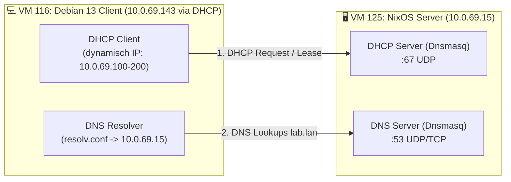

# Debian 13 Client VM — Test- en Verificatiehandleiding
---

## 🗺️ Overzicht van het Lab



### 📋 Referentiegegevens

| Onderdeel | Parameter / Waarde | Toelichting |
| :--- | :--- | :--- |
| **Server Hostname** | `server.lab.lan` | Centrale NixOS server (VM 125) |
| **Server IP** | `10.0.69.15` | Statisch IP-adres op VM 125 |
| **Client Hostname** | `client.lab.lan` / `debian-1` | Debian 13 client (VM 116) |
| **Client Subnet** | `10.0.69.0/24` | Netmask `255.255.255.0` (SDN op `pve05`) |
| **Standaard Gateway** | `10.0.69.1` | Gateway van het lab-netwerk (met SNAT) |
| **DHCP Pool** | `10.0.69.100` – `10.0.69.200` | Dynamisch uitgedeeld door Dnsmasq |
| **DNS Domein** | `lab.lan` | Zoekdomein op de client |
| **LDAP Base DN** | `dc=lab,dc=lan` | OpenLDAP boomstructuur |
| **LDAP Test User 1** | `user1` / Wachtwoord: `Password123!` | UID: 10001, GID: 10001 (`labusers`) |
| **LDAP Test User 2** | `user2` / Wachtwoord: `Password123!` | UID: 10002, GID: 10001 (`labusers`) |
| **LDAP Admin DN** | `cn=admin,dc=lab,dc=lan` / `adminpassword` | Volledige rechten in LDAP |
| **Samba Public Share** | `//server.lab.lan/public` | Vrij toegankelijk voor gasten (Read/Write) |
| **Samba Secured Share** | `//server.lab.lan/secured` | Alleen voor geauthenticeerde users (`Password123!`) |

---

## 📡 Test 1: DHCP Client (Dynamische Netwerkconfiguratie)

### Doel
Controleren of de Debian 13 client automatisch een IP-adres krijgt binnen de pool `10.0.69.100`–`10.0.69.200`, met de juiste gateway (`10.0.69.1`) en DNS-server (`10.0.69.15`).

### Configuratie op Debian 13
Kies de netwerkmanager die actief is op je Debian installatie:

#### Optie A: Via `/etc/network/interfaces` (Standaard Debian server)
Controleer of de interface (`eth0`) op `dhcp` staat:

```bash
cat << 'EOF' > /etc/network/interfaces
auto lo
iface lo inet loopback

auto eth0
iface eth0 inet dhcp
EOF

# Herstart networking
systemctl restart networking
```

#### Optie B: Via `systemd-networkd`
```bash
mkdir -p /etc/systemd/network
cat << 'EOF' > /etc/systemd/network/20-wired.network
[Match]
Name=eth0

[Network]
DHCP=ipv4
EOF

systemctl enable --now systemd-networkd
systemctl restart systemd-networkd
```

#### Optie C: Handmatig vernieuwen via `dhclient`
```bash
# Installeer isc-dhcp-client indien nodig
apt install -y isc-dhcp-client

# Vrijgeven en nieuw lease ophalen
dhclient -r eth0
dhclient -v eth0
```

---

### Verificatiestappen & Verwacht Resultaat

1. **IP-adres controleren:**
   ```bash
   ip -4 addr show eth0
   ```
   * **Verwacht:** Een IP-adres in de reeks `10.0.69.100` t/m `10.0.69.200` met subnetmasker `/24`.

2. **Standaard gateway controleren:**
   ```bash
   ip route show
   ```
   * **Verwacht:** `default via 10.0.69.1 dev eth0 ...`

3. **DNS resolver instellingen controleren:**
   ```bash
   cat /etc/resolv.conf
   ```
   * **Verwacht:**
     ```
     nameserver 10.0.69.15
     search lab.lan
     ```

4. **Controleer lease op VM 1 (Server-side):**
   Voer uit op VM 1 (`10.0.69.15`):
   ```bash
   cat /var/lib/dnsmasq/dnsmasq.leases
   ```
   * **Verwacht:** Een regel met het MAC-adres van VM 2, het toegekende IP-adres en de hostname.

---

## 🔍 Test 2: DNS Naamresolutie

### Doel
Aantonen dat VM 1 zowel interne `.lab.lan` adressen resolveert als externe internetadressen forwardt.

### Installatie testtools
```bash
apt install -y dnsutils iputils-ping
```

### Verificatiestappen

1. **Test lokale server records via VM 1 DNS:**
   ```bash
   dig @10.0.69.15 server.lab.lan +short
   dig @10.0.69.15 ldap.lab.lan +short
   dig @10.0.69.15 samba.lab.lan +short
   ```
   * **Verwacht:** Drie keer het antwoord `10.0.69.15`.

2. **Test systeem-resolver en zoekdomein (`search lab.lan`):**
   ```bash
   # Ping op korte naam (breidt automatisch uit naar server.lab.lan)
   ping -c 2 server
   ping -c 2 samba
   ```
   * **Verwacht:** Pings slagen naar `10.0.69.15`.

3. **Test upstream internet forwarding:**
   ```bash
   dig @10.0.69.15 google.com +short
   ping -c 2 google.com
   ```
   * **Verwacht:** Geldig openbaar IP-adres en succesvolle ICMP-antwoorden via de Cloudflare upstream forwarder van Dnsmasq.

---

## 🔐 Test 3: OpenLDAP & Centrale Authenticatie (SSSD + PAM + NSS)

### Doel
Aantonen dat gebruikers (`user1`, `user2`) centraal worden opgehaald uit OpenLDAP en kunnen inloggen op de CLI van de Debian 13 VM.

---

### Stap 3.1: Installatie van client pakketten
```bash
apt install -y sssd sssd-ldap libpam-sss libnss-sss ldap-utils libpam-modules
```

---

### Stap 3.2: Directe LDAP Connectietest (`ldapsearch`)
Controleer eerst of de OpenLDAP container bereikbaar is vanaf Debian:

```bash
# Zoek alle gebruikers op met de readonly gebruiker
ldapsearch -x -H ldap://server.lab.lan \
  -D "cn=readonly,dc=lab,dc=lan" \
  -w readonlypassword \
  -b "ou=people,dc=lab,dc=lan" uid
```
* **Verwacht:** Je ziet de entries voor `uid=user1,ou=people,dc=lab,dc=lan` en `uid=user2,ou=people,dc=lab,dc=lan` met `result: 0 Success`.
> [!NOTE]
> Een anonieme query (`ldapsearch -x -b "dc=lab,dc=lan" -s base`) geeft in Osixia OpenLDAP standaard `result: 32 No such object` omdat anonieme leesrechten zijn afgeschermd. Daarom gebruikt SSSD in stap 3.3 het `readonly` service account.

---

### Stap 3.3: SSSD Configureren

Maak het configuratiebestand `/etc/sssd/sssd.conf` aan:

```bash
cat << 'EOF' > /etc/sssd/sssd.conf
[sssd]
services = nss, pam
domains = lab.lan
config_file_version = 2

[domain/lab.lan]
id_provider = ldap
auth_provider = ldap
chpass_provider = ldap

# LDAP Server verbinding
ldap_uri = ldap://server.lab.lan:389
ldap_search_base = dc=lab,dc=lan

# Bind credentials (gebruik het readonly account)
ldap_default_bind_dn = cn=readonly,dc=lab,dc=lan
ldap_default_authtok = readonlypassword

# Zoekpaden voor gebruikers en groepen
ldap_user_search_base = ou=people,dc=lab,dc=lan
ldap_group_search_base = ou=groups,dc=lab,dc=lan

# Objectklassen en attributen
ldap_user_object_class = posixAccount
ldap_user_name = uid
ldap_user_home_directory = homeDirectory
ldap_user_shell = loginShell

ldap_group_object_class = posixGroup
ldap_group_member = memberUid

# Geen TLS in lab-omgeving (STARTTLS uitschakelen voor poort 389)
ldap_id_use_start_tls = false
ldap_auth_disable_tls_never_use_in_production = true
ldap_tls_reqcert = never

# Directe UID/GID mapping vanuit LDAP posixAccount
ldap_id_mapping = false

# Offline caching & performance
cache_credentials = true
enumerate = true
EOF

# SSSD vereist strikte permissies (anders start de service niet!)
chmod 600 /etc/sssd/sssd.conf
chown root:root /etc/sssd/sssd.conf

# Controleer of /etc/nsswitch.conf 'sss' bevat voor passwd en group
sed -i '/^passwd:/ s/$/ sss/' /etc/nsswitch.conf
sed -i '/^group:/ s/$/ sss/' /etc/nsswitch.conf
sed -i 's/sss sss/sss/g' /etc/nsswitch.conf
```

Start en activeer SSSD (en leeg de cache):
```bash
sss_cache -E
systemctl restart sssd
systemctl enable sssd
systemctl status sssd --no-pager
```

---

### Stap 3.4: Automatische Home Directory Aanmaak Activeren (PAM)
Zorg dat bij de eerste login automatisch `/home/user1` wordt gegenereerd:

```bash
# Activeer pam_mkhomedir via pam-auth-update
pam-auth-update --enable mkhomedir
```
*(Of voeg handmatig `session optional pam_mkhomedir.so skel=/etc/skel umask=077` toe aan `/etc/pam.d/common-session`)*.

---

### Stap 3.5: NSS & CLI Login Verifiëren

1. **Gebruikersresolutie testen via NSS (`getent`):**
   ```bash
   getent passwd user1
   getent passwd user2
   ```
   * **Verwacht:**
     ```
     user1:*:10001:10001:User One:/home/user1:/bin/bash
     user2:*:10002:10001:User Two:/home/user2:/bin/bash
     ```

2. **Groepsresolutie testen:**
   ```bash
   getent group labusers
   id user1
   ```
   * **Verwacht:**
     ```
     labusers:*:10001:user1,user2
     uid=10001(user1) gid=10001(labusers) groups=10001(labusers)
     ```

3. **CLI Login testen met `su`:**
   ```bash
   su - user1
   ```
   * Voer het wachtwoord in: `Password123!`
   * **Verwacht:**
     * Bericht: `Creating directory '/home/user1'.`
     * De prompt verandert naar: `user1@debian:~$`
     * Controleer met `whoami` (geeft `user1`) en `pwd` (geeft `/home/user1`).
   * Sluit de sessie af met `exit`.

4. **SSH Login testen (optioneel):**
   Vanaf een andere machine of lokaal:
   ```bash
   ssh user1@localhost
   ```
   * Inloggen met `Password123!` slaagt direct via PAM.

---

## 📁 Test 4: Samba SMB/CIFS Netwerkshares

### Doel
Aantonen dat de Debian 13 VM zowel anonieme/publieke netwerkmappen als beveiligde shares kan mounten en bewerken.

---

### Stap 4.1: Installatie van client tools
```bash
apt install -y cifs-utils smbclient
```

---

### Stap 4.2: Shares Ontdekken (Discovery)
Bekijk de beschikbare shares op de Samba-server:

```bash
smbclient -L //server.lab.lan -N
```
* **Verwacht:**
  ```
  Sharename       Type      Comment
  ---------       ----      -------
  public          Disk      Public Share
  secured         Disk      Secured Share
  IPC$            IPC       IPC Service (Lab Samba Server)
  ```

---

### Stap 4.3: Test Public Share (Gast / Anoniem)

1. **Interactief testen met `smbclient`:**
   ```bash
   smbclient //server.lab.lan/public -N -c "ls"
   ```

2. **Mounten naar lokale map:**
   ```bash
   mkdir -p /mnt/public
   mount -t cifs //server.lab.lan/public /mnt/public -o guest

   # Controleer mount
   df -h /mnt/public
   ```

3. **Bestand aanmaken en controleren:**
   ```bash
   echo "Debian 13 testbestand op $(date)" > /mnt/public/client-test.txt
   cat /mnt/public/client-test.txt
   ls -la /mnt/public/client-test.txt
   ```

4. **Unmounten:**
   ```bash
   umount /mnt/public
   ```

---

### Stap 4.4: Test Secured Share (Geauthenticeerd)

1. **Negatieve test (Anonieme toegang moet mislukken):**
   ```bash
   smbclient //server.lab.lan/secured -N -c "ls"
   ```
   * **Verwacht:** `NT_STATUS_ACCESS_DENIED` of `NT_STATUS_LOGON_FAILURE`.

2. **Negatieve test (Foutief wachtwoord moet mislukken):**
   ```bash
   smbclient //server.lab.lan/secured -U user1%FoutWachtwoord -c "ls"
   ```
   * **Verwacht:** `NT_STATUS_LOGON_FAILURE`.

3. **Positieve test met geldige inloggegevens:**
   ```bash
   smbclient //server.lab.lan/secured -U 'user1%Password123!' -c "ls"
   ```
   * **Verwacht:** Succesvolle listing van de directory.

4. **Mounten naar lokale map:**
   ```bash
   mkdir -p /mnt/secured
   mount -t cifs //server.lab.lan/secured /mnt/secured \
     -o 'username=user1,password=Password123!,uid=user1,gid=labusers'

   # Controleer mount
   df -h /mnt/secured
   ```

5. **Schrijftest uitvoeren:**
   ```bash
   echo "Beveiligde data geschreven door user1" > /mnt/secured/geheim.txt
   cat /mnt/secured/geheim.txt
   ls -la /mnt/secured/geheim.txt
   ```

6. **Unmounten:**
   ```bash
   umount /mnt/secured
   ```

---

### Stap 4.5: Permanente Mounts via `/etc/fstab` (Optioneel)
Om de shares bij elke boot automatisch te mounten:

1. Maak een beveiligd credentialsbestand aan:
   ```bash
   cat << 'EOF' > /etc/samba/credentials-user1
   username=user1
   password=Password123!
   EOF

   chmod 600 /etc/samba/credentials-user1
   ```

2. Voeg toe aan `/etc/fstab`:
   ```fstab
   //server.lab.lan/public   /mnt/public   cifs  guest,nofail,_netdev  0 0
   //server.lab.lan/secured  /mnt/secured  cifs  credentials=/etc/samba/credentials-user1,uid=user1,gid=10001,nofail,_netdev  0 0
   ```

3. Test fstab:
   ```bash
   mount -a
   ls /mnt/public
   ls /mnt/secured
   ```
