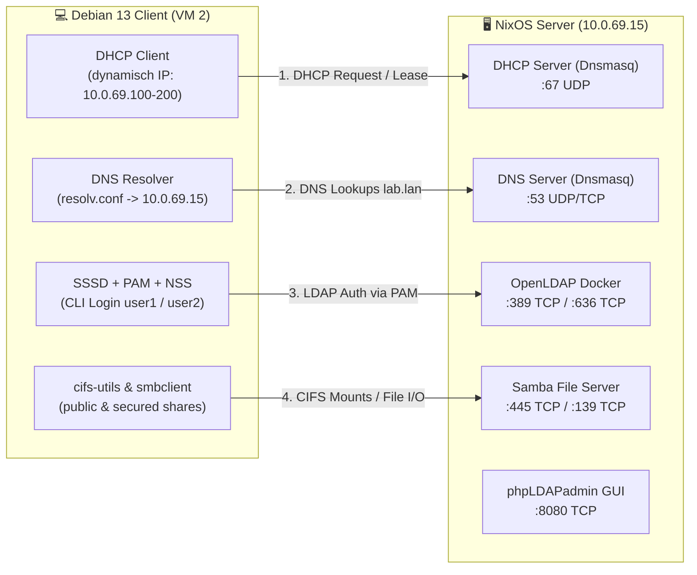

# Debian 13 (Trixie) Client VM — Test- en Verificatiehandleiding

Deze handleiding beschrijft stap voor stap hoe je vanaf de **Debian 13 client VM** controleert en aantoont dat alle centrale netwerkdiensten op de **NixOS Server (VM 1)** correct functioneren volgens de leerdoelen in [ARCHITECTURE.md](ARCHITECTURE.md) en [README.md](README.md).

---

## 🗺️ Overzicht van het Lab



### 📋 Referentiegegevens

| Onderdeel | Parameter / Waarde | Toelichting |
| :--- | :--- | :--- |
| **Server Hostname** | `server.lab.lan` | Centrale NixOS server |
| **Server IP** | `10.0.69.15` | Statisch IP-adres op VM 1 |
| **Client Subnet** | `10.0.69.0/24` | Netmask `255.255.255.0` |
| **Standaard Gateway** | `10.0.69.1` | Gateway van het lab-netwerk |
| **DHCP Pool** | `10.0.69.100` – `10.0.69.200` | Dynamisch uitgedeeld door Dnsmasq |
| **DNS Domein** | `lab.lan` | Zoekdomein op de client |
| **LDAP Base DN** | `dc=lab,dc=lan` | OpenLDAP boomstructuur |
| **LDAP Test User 1** | `user1` / Wachtwoord: `Password123!` | UID: 10001, GID: 10001 (`labusers`) |
| **LDAP Test User 2** | `user2` / Wachtwoord: `Password123!` | UID: 10002, GID: 10001 (`labusers`) |
| **LDAP Admin DN** | `cn=admin,dc=lab,dc=lan` / `adminpassword` | Volledige rechten in LDAP |
| **Samba Public Share** | `//server.lab.lan/public` | Vrij toegankelijk voor gasten (Read/Write) |
| **Samba Secured Share** | `//server.lab.lan/secured` | Alleen voor geauthenticeerde users (`Password123!`) |

---

## 🛠️ Voorbereiding op Debian 13

Log in op de Debian 13 VM via de Proxmox console als `root` (of via een gebruiker met `sudo`):

```bash
# Update pakketlijsten
apt update
```

---

## 📡 Test 1: DHCP Client (Dynamische Netwerkconfiguratie)

### Doel
Controleren of de Debian 13 client automatisch een IP-adres krijgt binnen de pool `10.0.69.100`–`10.0.69.200`, met de juiste gateway (`10.0.69.1`) en DNS-server (`10.0.69.15`).

### Configuratie op Debian 13
Kies de netwerkmanager die actief is op je Debian installatie:

#### Optie A: Via `/etc/network/interfaces` (Standaard Debian server)
Controleer of de interface (bijv. `ens18` of `eth0`) op `dhcp` staat:

```bash
cat << 'EOF' > /etc/network/interfaces
auto lo
iface lo inet loopback

auto ens18
iface ens18 inet dhcp
EOF

# Herstart networking
systemctl restart networking
```

#### Optie B: Via `systemd-networkd`
```bash
mkdir -p /etc/systemd/network
cat << 'EOF' > /etc/systemd/network/20-wired.network
[Match]
Name=ens18

[Network]
DHCP=ipv4
EOF

systemctl enable --now systemd-networkd
systemctl restart systemd-networkd
```

#### Optie C: Handmatig vernieuwen via `dhclient`
```bash
# Installeer isc-dhcp-client indien nodig
apt install -y isc-dhcp-client

# Vrijgeven en nieuw lease ophalen
dhclient -r ens18
dhclient -v ens18
```

---

### Verificatiestappen & Verwacht Resultaat

1. **IP-adres controleren:**
   ```bash
   ip -4 addr show ens18
   ```
   * **Verwacht:** Een IP-adres in de reeks `10.0.69.100` t/m `10.0.69.200` met subnetmasker `/24`.

2. **Standaard gateway controleren:**
   ```bash
   ip route show
   ```
   * **Verwacht:** `default via 10.0.69.1 dev ens18 ...`

3. **DNS resolver instellingen controleren:**
   ```bash
   cat /etc/resolv.conf
   ```
   * **Verwacht:**
     ```
     nameserver 10.0.69.15
     search lab.lan
     ```

4. **Controleer lease op VM 1 (Server-side):**
   Voer uit op VM 1 (`10.0.69.15`):
   ```bash
   cat /var/lib/dnsmasq/dnsmasq.leases
   ```
   * **Verwacht:** Een regel met het MAC-adres van VM 2, het toegekende IP-adres en de hostname.

---

## 🔍 Test 2: DNS Naamresolutie

### Doel
Aantonen dat VM 1 zowel interne `.lab.lan` adressen resolveert als externe internetadressen forwardt.

### Installatie testtools
```bash
apt install -y dnsutils iputils-ping
```

### Verificatiestappen

1. **Test lokale server records via VM 1 DNS:**
   ```bash
   dig @10.0.69.15 server.lab.lan +short
   dig @10.0.69.15 ldap.lab.lan +short
   dig @10.0.69.15 samba.lab.lan +short
   ```
   * **Verwacht:** Drie keer het antwoord `10.0.69.15`.

2. **Test systeem-resolver en zoekdomein (`search lab.lan`):**
   ```bash
   # Ping op korte naam (breidt automatisch uit naar server.lab.lan)
   ping -c 2 server
   ping -c 2 samba
   ```
   * **Verwacht:** Pings slagen naar `10.0.69.15`.

3. **Test upstream internet forwarding:**
   ```bash
   dig @10.0.69.15 google.com +short
   ping -c 2 google.com
   ```
   * **Verwacht:** Geldig openbaar IP-adres en succesvolle ICMP-antwoorden via de Cloudflare upstream forwarder van Dnsmasq.

---

## 🔐 Test 3: OpenLDAP & Centrale Authenticatie (SSSD + PAM + NSS)

### Doel
Aantonen dat gebruikers (`user1`, `user2`) centraal worden opgehaald uit OpenLDAP en kunnen inloggen op de CLI van de Debian 13 VM.

---

### Stap 3.1: Installatie van client pakketten
```bash
apt install -y sssd sssd-ldap libpam-sss libnss-sss ldap-utils libpam-modules
```

---

### Stap 3.2: Directe LDAP Connectietest (`ldapsearch`)
Controleer eerst of de OpenLDAP container bereikbaar is vanaf Debian:

```bash
# Zoek alle gebruikers op met de readonly gebruiker
ldapsearch -x -H ldap://server.lab.lan \
  -D "cn=readonly,dc=lab,dc=lan" \
  -w readonlypassword \
  -b "ou=people,dc=lab,dc=lan" uid
```
* **Verwacht:** Je ziet de entries voor `uid=user1,ou=people,dc=lab,dc=lan` en `uid=user2,ou=people,dc=lab,dc=lan` met `result: 0 Success`.
> [!NOTE]
> Een anonieme query (`ldapsearch -x -b "dc=lab,dc=lan" -s base`) geeft in Osixia OpenLDAP standaard `result: 32 No such object` omdat anonieme leesrechten zijn afgeschermd. Daarom gebruikt SSSD in stap 3.3 het `readonly` service account.

---

### Stap 3.3: SSSD Configureren

Maak het configuratiebestand `/etc/sssd/sssd.conf` aan:

```bash
cat << 'EOF' > /etc/sssd/sssd.conf
[sssd]
services = nss, pam
domains = lab.lan
config_file_version = 2

[domain/lab.lan]
id_provider = ldap
auth_provider = ldap
chpass_provider = ldap

# LDAP Server verbinding
ldap_uri = ldap://server.lab.lan:389
ldap_search_base = dc=lab,dc=lan

# Bind credentials (gebruik het readonly account)
ldap_default_bind_dn = cn=readonly,dc=lab,dc=lan
ldap_default_authtok = readonlypassword

# Zoekpaden voor gebruikers en groepen
ldap_user_search_base = ou=people,dc=lab,dc=lan
ldap_group_search_base = ou=groups,dc=lab,dc=lan

# Objectklassen en attributen
ldap_user_object_class = posixAccount
ldap_user_name = uid
ldap_user_home_directory = homeDirectory
ldap_user_shell = loginShell

ldap_group_object_class = posixGroup
ldap_group_member = memberUid

# Geen TLS in lab-omgeving (STARTTLS uitschakelen voor poort 389)
ldap_id_use_start_tls = false
ldap_auth_disable_tls_never_use_in_production = true
ldap_tls_reqcert = never

# Directe UID/GID mapping vanuit LDAP posixAccount
ldap_id_mapping = false

# Offline caching & performance
cache_credentials = true
enumerate = true
EOF

# SSSD vereist strikte permissies (anders start de service niet!)
chmod 600 /etc/sssd/sssd.conf
chown root:root /etc/sssd/sssd.conf

# Controleer of /etc/nsswitch.conf 'sss' bevat voor passwd en group
sed -i '/^passwd:/ s/$/ sss/' /etc/nsswitch.conf
sed -i '/^group:/ s/$/ sss/' /etc/nsswitch.conf
sed -i 's/sss sss/sss/g' /etc/nsswitch.conf
```

Start en activeer SSSD (en leeg de cache):
```bash
sss_cache -E
systemctl restart sssd
systemctl enable sssd
systemctl status sssd --no-pager
```

---

### Stap 3.4: Automatische Home Directory Aanmaak Activeren (PAM)
Zorg dat bij de eerste login automatisch `/home/user1` wordt gegenereerd:

```bash
# Activeer pam_mkhomedir via pam-auth-update
pam-auth-update --enable mkhomedir
```
*(Of voeg handmatig `session optional pam_mkhomedir.so skel=/etc/skel umask=077` toe aan `/etc/pam.d/common-session`)*.

---

### Stap 3.5: NSS & CLI Login Verifiëren

1. **Gebruikersresolutie testen via NSS (`getent`):**
   ```bash
   getent passwd user1
   getent passwd user2
   ```
   * **Verwacht:**
     ```
     user1:*:10001:10001:User One:/home/user1:/bin/bash
     user2:*:10002:10001:User Two:/home/user2:/bin/bash
     ```

2. **Groepsresolutie testen:**
   ```bash
   getent group labusers
   id user1
   ```
   * **Verwacht:**
     ```
     labusers:*:10001:user1,user2
     uid=10001(user1) gid=10001(labusers) groups=10001(labusers)
     ```

3. **CLI Login testen met `su`:**
   ```bash
   su - user1
   ```
   * Voer het wachtwoord in: `Password123!`
   * **Verwacht:**
     * Bericht: `Creating directory '/home/user1'.`
     * De prompt verandert naar: `user1@debian:~$`
     * Controleer met `whoami` (geeft `user1`) en `pwd` (geeft `/home/user1`).
   * Sluit de sessie af met `exit`.

4. **SSH Login testen (optioneel):**
   Vanaf een andere machine of lokaal:
   ```bash
   ssh user1@localhost
   ```
   * Inloggen met `Password123!` slaagt direct via PAM.

---

## 📁 Test 4: Samba SMB/CIFS Netwerkshares

### Doel
Aantonen dat de Debian 13 VM zowel anonieme/publieke netwerkmappen als beveiligde shares kan mounten en bewerken.

---

### Stap 4.1: Installatie van client tools
```bash
apt install -y cifs-utils smbclient
```

---

### Stap 4.2: Shares Ontdekken (Discovery)
Bekijk de beschikbare shares op de Samba-server:

```bash
smbclient -L //server.lab.lan -N
```
* **Verwacht:**
  ```
  Sharename       Type      Comment
  ---------       ----      -------
  public          Disk      Public Share
  secured         Disk      Secured Share
  IPC$            IPC       IPC Service (Lab Samba Server)
  ```

---

### Stap 4.3: Test Public Share (Gast / Anoniem)

1. **Interactief testen met `smbclient`:**
   ```bash
   smbclient //server.lab.lan/public -N -c "ls"
   ```

2. **Mounten naar lokale map:**
   ```bash
   mkdir -p /mnt/public
   mount -t cifs //server.lab.lan/public /mnt/public -o guest

   # Controleer mount
   df -h /mnt/public
   ```

3. **Bestand aanmaken en controleren:**
   ```bash
   echo "Debian 13 testbestand op $(date)" > /mnt/public/client-test.txt
   cat /mnt/public/client-test.txt
   ls -la /mnt/public/client-test.txt
   ```

4. **Unmounten:**
   ```bash
   umount /mnt/public
   ```

---

### Stap 4.4: Test Secured Share (Geauthenticeerd)

1. **Negatieve test (Anonieme toegang moet mislukken):**
   ```bash
   smbclient //server.lab.lan/secured -N -c "ls"
   ```
   * **Verwacht:** `NT_STATUS_ACCESS_DENIED` of `NT_STATUS_LOGON_FAILURE`.

2. **Negatieve test (Foutief wachtwoord moet mislukken):**
   ```bash
   smbclient //server.lab.lan/secured -U user1%FoutWachtwoord -c "ls"
   ```
   * **Verwacht:** `NT_STATUS_LOGON_FAILURE`.

3. **Positieve test met geldige inloggegevens:**
   ```bash
   smbclient //server.lab.lan/secured -U 'user1%Password123!' -c "ls"
   ```
   * **Verwacht:** Succesvolle listing van de directory.

4. **Mounten naar lokale map:**
   ```bash
   mkdir -p /mnt/secured
   mount -t cifs //server.lab.lan/secured /mnt/secured \
     -o 'username=user1,password=Password123!,uid=user1,gid=labusers'

   # Controleer mount
   df -h /mnt/secured
   ```

5. **Schrijftest uitvoeren:**
   ```bash
   echo "Beveiligde data geschreven door user1" > /mnt/secured/geheim.txt
   cat /mnt/secured/geheim.txt
   ls -la /mnt/secured/geheim.txt
   ```

6. **Unmounten:**
   ```bash
   umount /mnt/secured
   ```

---

### Stap 4.5: Permanente Mounts via `/etc/fstab` (Optioneel)
Om de shares bij elke boot automatisch te mounten:

1. Maak een beveiligd credentialsbestand aan:
   ```bash
   cat << 'EOF' > /etc/samba/credentials-user1
   username=user1
   password=Password123!
   EOF

   chmod 600 /etc/samba/credentials-user1
   ```

2. Voeg toe aan `/etc/fstab`:
   ```fstab
   //server.lab.lan/public   /mnt/public   cifs  guest,nofail,_netdev  0 0
   //server.lab.lan/secured  /mnt/secured  cifs  credentials=/etc/samba/credentials-user1,uid=user1,gid=10001,nofail,_netdev  0 0
   ```

3. Test fstab:
   ```bash
   mount -a
   ls /mnt/public
   ls /mnt/secured
   ```

---

## 🛡️ Test 5: Network & OS Security (Proxmox VE Firewall Validatie)

### Doel
Aantonen dat het lab-netwerk effectief beveiligd wordt via de **Proxmox VE Firewall** (op hypervisor-niveau vóór de VM interface). We doorlopen twee fasen:
1. **Fase A (Huidige situatie / Baseline):** Meten wat de huidige status is terwijl de PVE firewall **uitgeschakeld** is.
2. **Fase B (PVE Firewall Actief):** Configureren van de PVE firewall en aantonen dat labdiensten intact blijven, terwijl beheerpoorten (SSH `22`, phpLDAPadmin `8080`) en gesloten poorten effectief worden afgeschermd voor gewone clients.

> [!NOTE]
> De host-firewall binnen NixOS staat uitgeschakeld (`networking.firewall.enable = false`). De beveiliging en poortfiltering worden centraal beheerd via de Proxmox VE Firewall op de virtuele interfaces (`net0`/`net1`) van de VM's.
> Zie voor de diepgaande architectuur en configuratie: [PROXMOX_FIREWALL_GUIDE.md](PROXMOX_FIREWALL_GUIDE.md).

### 📋 Betrokken VM's in Proxmox VE
* **`debian-1` (Client VM):** `10.0.69.143` (ontvangen via DHCP van `nixos-1`)
* **`nixos-1` (Server VM):** `10.0.69.15` (statisch IP)
* **`debian-jump host` (Beheer Host):** `10.19.10.17` (extern via DHCP) en `10.0.69.5` (statisch SDN)
* **SDN Subnet `10.0.69.0/24`:** Gateway `10.0.69.1` met SNAT (biedt internet, maar géén DNS of DHCP).

---

### Stap 5.1: Installatie testtools op Debian 13
Voer uit op `debian-1`:
```bash
apt install -y nmap curl iputils-ping
```

---

### Stap 5.2: Fase A — Baseline Test (Huidige situatie: Firewall UIT in PVE)

In de huidige situatie staat de Proxmox VE firewall uitgeschakeld. Dit brengt twee specifieke gedragingen met zich mee:
1. **Beheerpoorten staan open voor de client:** Zowel SSH (poort `22`) als de web GUI van phpLDAPadmin (poort `8080`) zijn bereikbaar voor de unprivileged client VM `debian-1`.
2. **Gesloten poorten geven `closed` i.p.v. `filtered`:** Omdat er geen firewall is die pakketten blokkeert (DROP), stuurt de Linux kernel van VM 1 direct een TCP RST-vlag terug. Hierdoor ziet een scanner zoals `nmap` de status `closed`.

#### 1. Baseline poortscan uitvoeren vanaf `debian-1`:
```bash
nmap -Pn -p 22,53,80,139,389,445,636,3306,8080 server.lab.lan
```
* **Verwacht resultaat (Baseline - Firewall UIT):**
  ```text
  PORT     STATE  SERVICE
  22/tcp   open   ssh           <-- Open voor gewone client!
  53/tcp   open   domain
  80/tcp   closed http          <-- Status 'closed' (TCP RST: geen firewall drop!)
  139/tcp  open   netbios-ssn
  389/tcp  open   ldap
  445/tcp  open   microsoft-ds
  636/tcp  open   ldaps
  3306/tcp closed mysql         <-- Status 'closed' (geen firewall drop!)
  8080/tcp open   http-proxy    <-- Veiligheidsrisico: phpLDAPadmin bereikbaar voor client!
  ```

#### 2. Baseline web GUI test vanaf `debian-1`:
```bash
curl -I --connect-timeout 3 http://server.lab.lan:8080
```
* **Verwacht resultaat:** Geeft direct `HTTP/1.1 200 OK` (of `302 Found`). Dit toont aan dat de webinterface momenteel onbeschermd toegankelijk is voor gebruikers op de client VM.

---

### Stap 5.3: Proxmox VE Firewall Instellen voor Server & Client

Stel in de Proxmox VE Web GUI de volgende firewallconfiguratie in:

#### 1. Globale activatie (Cluster & Interfaces):
* **Datacenter -> Firewall -> Options:** Zet `Firewall: Yes`.
* **Voor elke VM (`nixos-1`, `debian-1`, `debian-jump host`):** Ga naar `Hardware` -> dubbelklik op `Network Device (net0)` -> Vink **Firewall** aan. *(Zonder dit vinkje is de firewall per VM inactief!)*.

#### 2. Regels op `nixos-1` (Server VM — `10.0.69.15`):
* **Options:** `Firewall: Yes`, `Input Policy: DROP`, `Output Policy: ACCEPT`.
* **Firewall Rules:**
  1. `IN ACCEPT -p icmp` *(Ping)*
  2. `IN ACCEPT -source 10.0.69.5 -p tcp --dport 22` *(SSH: **Alleen** Jump Host)*
  3. `IN ACCEPT -source 10.0.69.5 -p tcp --dport 8080` *(phpLDAPadmin: **Alleen** Jump Host)*
  4. `IN ACCEPT -p tcp --dport 139` *(NetBIOS)*
  5. `IN ACCEPT -p tcp --dport 445` *(Samba)*
  6. `IN ACCEPT -p tcp --dport 636` *(LDAPS)*
  7. `IN ACCEPT -p tcp --dport 389` *(LDAP)*
  8. `IN ACCEPT -p tcp --dport 53` *(DNS TCP)*
  9. `IN ACCEPT -p udp --dport 53` *(DNS UDP)*
  10. `IN ACCEPT -p udp --dport 67` *(DHCP Server broadcast: Source leeg laten!)*

> [!TIP]
> Het instellen van een bron-IP (`Source IP`) is voor algemene labdiensten (zoals DNS, SMB, LDAP) leeg gelaten omdat `net0` uitsluitend aan het geïsoleerde SDN-netwerk hangt. Alleen voor SSH (`22`) en phpLDAPadmin (`8080`) is specifiek de Jump Host (`10.0.69.5`) ingesteld.

#### 3. Regels op `debian-1` (Client VM — `10.0.69.143`):
* **Options:** `Firewall: Yes`, `Input Policy: DROP`, `Output Policy: ACCEPT`.
* **Firewall Rules:**
  1. `IN ACCEPT -p udp --dport 68 -source 10.0.69.15` *(DHCP replies)*
  2. `IN ACCEPT -p tcp --dport 22 -source 10.0.69.5` *(SSH vanaf Jump Host)*
  3. `IN ACCEPT -p icmp` *(Ping)*

*(Voor de volledige handleiding inclusief de Jump Host configuratie, zie [PROXMOX_FIREWALL_GUIDE.md](PROXMOX_FIREWALL_GUIDE.md)).*

---

### Stap 5.4: Fase B — Post-Firewall Verificatiestappen (Firewall AAN)

Nadat de firewallregels in PVE zijn geactiveerd, voer je de validatie uit vanaf **`debian-1`**:

#### 1. Scan toegestane services (Moeten OPEN blijven):
```bash
nmap -Pn -p 53,139,389,445,636 server.lab.lan
```
* **Verwacht:** Alle labdiensten tonen ongewijzigd de status `open`.

#### 2. Scan afgeschermde en ongebruikte poorten (Security & Drop validatie):
```bash
nmap -Pn -p 22,80,3306,8080 server.lab.lan
```
* **Verwacht resultaat:**
  ```text
  PORT     STATE    SERVICE
  22/tcp   filtered ssh           <-- Geblokkeerd door PVE!
  80/tcp   filtered http          <-- Status veranderd van 'closed' naar 'filtered'!
  3306/tcp filtered mysql         <-- Status veranderd van 'closed' naar 'filtered'!
  8080/tcp filtered http-proxy    <-- phpLDAPadmin effectief afgeschermd!
  ```
  > [!TIP]
  > Het verschil tussen `closed` (fase A) en `filtered` (fase B) is hét bewijs dat de Proxmox VE firewall actief pakketten onderschept en dropt vóórdat de VM kernel kan reageren.

#### 3. Negatieve test phpLDAPadmin vanaf Debian client:
```bash
curl -I --connect-timeout 3 http://server.lab.lan:8080
```
* **Verwacht:** `curl: (28) Connection timed out after 3001 milliseconds`.

#### 4. Negatieve test SSH naar server vanaf Debian client:
```bash
ssh -o ConnectTimeout=3 nixos@server.lab.lan
```
* **Verwacht:** `Connection timed out`.

#### 5. Verifieer werking van centrale diensten en DHCP renewal:
```bash
# DNS controle
dig @10.0.69.15 server.lab.lan +short

# LDAP controle
ldapsearch -x -H ldap://server.lab.lan -D "cn=readonly,dc=lab,dc=lan" -w readonlypassword -b "ou=people,dc=lab,dc=lan" uid

# Samba share listing
smbclient -L //server.lab.lan -N

# DHCP renewal test
dhclient -r ens18 && dhclient -v ens18
```
* **Verwacht:** Alle centrale netwerkdiensten blijven vlekkeloos functioneren en de client behoudt/vernieuwt zijn lease (`10.0.69.143`).

---

### Stap 5.5: Beheervalidatie vanaf de Jump Host (`debian-jump host`)

Log in op de jump host (`10.19.10.17` / `10.0.69.5`) om te controleren of beheer wel mogelijk is:

1. **phpLDAPadmin Web GUI vanaf Jump Host:**
   ```bash
   curl -I http://10.0.69.15:8080
   ```
   * **Verwacht:** `HTTP/1.1 200 OK` (of 302 redirect). Open eventueel via een SSH tunnel of proxy in je browser: `http://10.0.69.15:8080`.
2. **SSH naar Server vanaf Jump Host:**
   ```bash
   ssh -o ConnectTimeout=3 nixos@10.0.69.15
   ```
   * **Verwacht:** Verbinding wordt direct gelegd.

---

## 🚀 Alles-in-één Geautomatiseerd Testscript

Voor snelle demonstratie en evaluatie kun je het volgende script draaien op de Debian 13 VM. Het controleert alle onderdelen inclusief de netwerksecurity achter elkaar en geeft een overzichtelijk rapport:

```bash
cat << 'EOF' > /root/test-all-services.sh
#!/usr/bin/env bash
set -e

GREEN='\033[0;32m'
RED='\033[0;31m'
NC='\033[0m'
BOLD='\033[1m'

pass() { echo -e "  [${GREEN}PASS${NC}] $1"; }
fail() { echo -e "  [${RED}FAIL${NC}] $1"; }

echo -e "\n${BOLD}====================================================${NC}"
echo -e "${BOLD}   Debian 13 Client — Linux Network Services Test   ${NC}"
echo -e "${BOLD}====================================================${NC}\n"

# 1. DHCP & IP
echo -e "${BOLD}1. Netwerk & DHCP Configuratie:${NC}"
CLIENT_IP=$(ip -4 addr show ens18 | grep -oP '(?<=inet\s)\d+(\.\d+){3}' || true)
if [[ "$CLIENT_IP" =~ ^10\.0\.69\.(1[0-9]{2}|200)$ ]]; then
    pass "IP-adres ($CLIENT_IP) ligt binnen DHCP pool 10.0.69.100-200"
else
    fail "Ongeldig of geen IP-adres gevonden: $CLIENT_IP"
fi

DEFAULT_GW=$(ip route | grep default | awk '{print $3}')
if [ "$DEFAULT_GW" == "10.0.69.1" ]; then
    pass "Standaard gateway is $DEFAULT_GW"
else
    fail "Onjuiste gateway: $DEFAULT_GW"
fi

# 2. DNS
echo -e "\n${BOLD}2. DNS Naamresolutie:${NC}"
SERVER_DNS=$(dig @10.0.69.15 server.lab.lan +short)
if [ "$SERVER_DNS" == "10.0.69.15" ]; then
    pass "server.lab.lan resolveert naar 10.0.69.15"
else
    fail "server.lab.lan kon niet worden geresolved"
fi

INTERNET_DNS=$(dig @10.0.69.15 google.com +short | head -n 1)
if [ -n "$INTERNET_DNS" ]; then
    pass "Upstream DNS forwarding functioneert (google.com -> $INTERNET_DNS)"
else
    fail "Upstream DNS forwarding mislukt"
fi

# 3. LDAP & SSSD
echo -e "\n${BOLD}3. OpenLDAP & SSSD Authenticatie:${NC}"
if getent passwd user1 > /dev/null 2>&1; then
    pass "LDAP gebruiker 'user1' gevonden via getent (NSS)"
else
    fail "LDAP gebruiker 'user1' NIET gevonden"
fi

if getent group labusers > /dev/null 2>&1; then
    pass "LDAP groep 'labusers' gevonden via getent"
else
    fail "LDAP groep 'labusers' NIET gevonden"
fi

# 4. Samba
echo -e "\n${BOLD}4. Samba File Server:${NC}"
if smbclient -L //server.lab.lan -N > /dev/null 2>&1; then
    pass "Samba shares ontdekt op server.lab.lan"
else
    fail "Samba discovery mislukt"
fi

if smbclient //server.lab.lan/public -N -c "ls" > /dev/null 2>&1; then
    pass "Public share gast-toegang geslaagd"
else
    fail "Public share gast-toegang geweigerd"
fi

if smbclient //server.lab.lan/secured -U user1%Password123! -c "ls" > /dev/null 2>&1; then
    pass "Secured share authenticatie (user1) geslaagd"
else
    fail "Secured share authenticatie met user1 mislukt"
fi

# 5. Firewall & Security Isolatie
echo -e "\n${BOLD}5. Proxmox VE Firewall Validatie:${NC}"
if curl -s --connect-timeout 2 http://server.lab.lan:8080 >/dev/null 2>&1; then
    fail "Beveiligingsrisico: phpLDAPadmin (poort 8080) is direct bereikbaar vanaf client!"
else
    pass "phpLDAPadmin (poort 8080) is effectief geblokkeerd voor de client"
fi

if nc -z -w 2 server.lab.lan 22 >/dev/null 2>&1; then
    fail "Beveiligingsrisico: SSH (poort 22) is direct bereikbaar vanaf client!"
else
    pass "Directe SSH toegang tot server (poort 22) is geblokkeerd voor client"
fi

echo -e "\n${BOLD}====================================================${NC}"
echo -e "${BOLD}              Verificatie Afgerond!                 ${NC}"
echo -e "${BOLD}====================================================${NC}\n"
EOF

chmod +x /root/test-all-services.sh
```

Draai het script eenvoudig via:
```bash
/root/test-all-services.sh
```

---

## 🔧 Veelvoorkomende Problemen & Oplossingen (Troubleshooting)

### 1. SSSD toont gewijzigde gebruikers niet direct
* **Oorzaak:** SSSD cacheert LDAP gegevens agressief.
* **Oplossing:** Leeg de SSSD cache:
  ```bash
  sss_cache -E
  systemctl restart sssd
  ```

### 2. `su - user1` geeft `Permission denied` op `/etc/sssd/sssd.conf`
* **Oorzaak:** Bestandspermissies van `sssd.conf` zijn te open.
* **Oplossing:**
  ```bash
  chmod 600 /etc/sssd/sssd.conf
  chown root:root /etc/sssd/sssd.conf
  systemctl restart sssd
  ```

### 3. CIFS mount geeft `mount error(13): Permission denied`
* **Oorzaak:** Foutief wachtwoord of SMBNTLM authenticatie mismatch.
* **Oplossing:**
  * Controleer of het wachtwoord exact `Password123!` is.
  * Controleer op VM 1 of de gebruiker in passdb zit:
    ```bash
    pdbedit -L -v -u user1
    ```
  * Reset eventueel handmatig het Samba-wachtwoord op VM 1:
    ```bash
    (echo "Password123!"; echo "Password123!") | smbpasswd -s -a user1
    ```

### 4. DHCP lease wordt niet vernieuwd
* **Oorzaak:** Oude lease cache op de client of ontbrekende DHCP UDP 67 broadcast regel op VM 1.
* **Oplossing:**
  ```bash
  dhclient -r -v ens18
  rm -f /var/lib/dhcp/dhclient.leases
  dhclient -v ens18
  ```

### 5. Client kan internet niet op ondanks geldige DHCP lease
* **Oorzaak:** SDN gateway `10.0.69.1` mist SNAT of DNS upstream forwarding ontbreekt in dnsmasq.
* **Oplossing:**
  * Test ping naar gateway: `ping -c 2 10.0.69.1`
  * Test upstream DNS query: `dig @10.0.69.15 1.1.1.1 +short`
  * Controleer in PVE onder SDN -> VNets of `SNAT` is aangevinkt op het `10.0.69.0/24` subnet.


