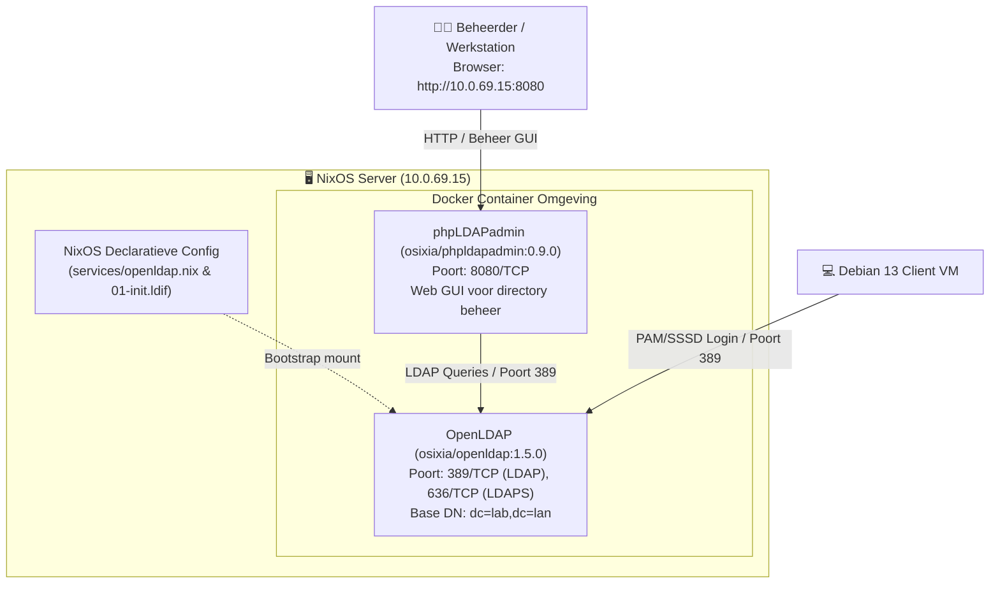

# OpenLDAP & phpLDAPadmin — Beheerdershandleiding & Configuratie

Deze handleiding beschrijft de werking, configuratie en het beheer van de centrale **OpenLDAP** directory service en de **phpLDAPadmin** webinterface op de centrale server (**VM 1 / `proxmox-vm-1`**).

---

## 🗺️ Overzicht van de LDAP Architectuur



---

## 🔑 Inloggegevens & Verbindingsparameters

De services zijn vooraf geconfigureerd met de volgende parameters:

| Parameter | Waarde | Beschrijving |
| :--- | :--- | :--- |
| **Server Hostname** | `server.lab.lan` (of `ldap.lab.lan`) | DNS FQDN van VM 1 |
| **Server IP** | `10.0.69.15` | Statisch IP-adres van VM 1 |
| **LDAP Poort** | `389` (Onversleuteld / StartTLS) | Standaard LDAP communicatiepoort |
| **LDAPS Poort** | `636` (SSL/TLS) | Beveiligde LDAP poort |
| **phpLDAPadmin GUI** | `http://10.0.69.15:8080` | Webinterface in browser |
| **Base DN** | `dc=lab,dc=lan` | Root van de directory tree |
| **Organisatie** | `Lab LAN` | Organisatienaam in LDAP |
| **Admin DN** | `cn=admin,dc=lab,dc=lan` | Volledige lees- en schrijfrechten |
| **Admin Wachtwoord** | `adminpassword` | Wachtwoord voor de `admin` beheerder |
| **Config Admin DN** | `cn=admin,cn=config` | Interne slapd configuratie beheerder |
| **Config Wachtwoord** | `configpassword` | Wachtwoord voor slapd configuratie |
| **Read-Only DN** | `cn=readonly,dc=lab,dc=lan` | Alleen-lezen account voor zoekopdrachten |
| **Read-Only Wachtwoord** | `readonlypassword` | Wachtwoord voor de readonly user |

---

## 🌐 1. phpLDAPadmin Web GUI (Gebruikersbeheer via de browser)
## SSH Port Forward using jumphost vm
```
ssh -L 8080:10.0.69.15:8080 root@10.19.10.17
```

### Stap 1.1: Webinterface openen
Navigeer in je browser (vanaf een werkstation met netwerktoegang tot het lab-subnet) naar:
```text
http://10.0.69.15:8080
```
*(Of via hostname: `http://server.lab.lan:8080`)*.

---

### Stap 1.2: Inloggen
1. Klik in het linkermenu op de server **10.0.69.15** of klik op **Login** in het linkermenu.
2. Vul de beheergegevens in:
   * **Login DN:** `cn=admin,dc=lab,dc=lan`
   * **Password:** `adminpassword`
3. Klik op **Authenticate**.

> [!TIP]
> Als je alleen de structuur wilt inzien zonder risico op per ongeluk wijzigen, kun je ook inloggen als:
> * **Login DN:** `cn=readonly,dc=lab,dc=lan`
> * **Password:** `readonlypassword`

---

### Stap 1.3: De Directory Tree Navigeren
Na het inloggen vouwt de directory-structuur open aan de linkerkant:

```text
dc=lab,dc=lan
├── ou=people
│   ├── uid=user1 (User One)
│   └── uid=user2 (User Two)
└── ou=groups
    └── cn=labusers (POSIX Group - GID 10001)
```

* **`ou=people`**: Bevat de gebruikersaccounts van het lab.
* **`ou=groups`**: Bevat de gebruikersgroepen (POSIX groepen voor Linux authenticatie).

---

### Stap 1.4: Een Nieuwe Gebruiker Aanmaken

1. Klik in het linkermenu op **`ou=people`**.
2. Klik in het hoofdscherm op **Create a child entry**.
3. Selecteer het template **Generic: User Account** (of kies *Default* en voeg de benodigde objectklassen toe).
4. Vul de vereiste velden in:
   * **First name:** Jan
   * **Last name:** Jansen
   * **Common Name (cn):** Jan Jansen
   * **User ID (uid):** `jjansen`
   * **Password:** Vul het gewenste wachtwoord in (bijv. `Password123!`) en selecteer encryptie (bijv. `ssha` of `md5`).
5. Voeg de POSIX attributen toe (vereist voor Linux CLI login):
   * **Object Class toevoegen:** Selecteer `posixAccount` en `shadowAccount`.
   * **UID Number:** Kies een uniek nummer boven 10000 (bijv. `10003`).
   * **GID Number:** `10001` (koppelt direct aan `cn=labusers`).
   * **Home directory:** `/home/jjansen`
   * **Login shell:** `/bin/bash`
6. Klik op **Create Object** en daarna op **Commit**.

---

### Stap 1.5: Een Gebruiker Toevoegen aan een Groep

1. Klik in het linkermenu op **`ou=groups`** -> **`cn=labusers`**.
2. Klik op **Add new attribute**.
3. Selecteer het attribuut **`memberUid`**.
4. Vul de gebruikersnaam in (bijv. `jjansen`).
5. Klik op **Update Object**.

---

### Stap 1.6: Wachtwoord van een Gebruiker Wijzigen

1. Klik op de gebruiker (bijv. `uid=user1`).
2. Zoek het attribuut **`userPassword`**.
3. Klik op **edit** of vul direct een nieuw wachtwoord in.
4. Kies het hash-algoritme (standaard `ssha`).
5. Klik op **Save changes**.

---

## 💻 2. Server-side CLI Beheer (NixOS Server VM 1)

Op de server zelf zijn alle benodigde LDAP tools geïnstalleerd via het pakket `pkgs.openldap`. Log in via SSH op VM 1 (`ssh root@10.0.69.15`).

### 2.1 Container & Service Status Controleren

```bash
# Bekijk de status van de Docker containers
docker ps

# Controleer de systemd services
systemctl status docker-openldap --no-pager
systemctl status docker-phpldapadmin --no-pager

# Bekijk live logs van OpenLDAP
docker logs -f openldap

# Bekijk live logs van phpLDAPadmin
docker logs -f phpldapadmin
```

---

### 2.2 Zoeken in LDAP met `ldapsearch`

1. **Zoek de hele directory op (als admin):**
   ```bash
   ldapsearch -x -H ldap://127.0.0.1 \
     -D "cn=admin,dc=lab,dc=lan" \
     -w adminpassword \
     -b "dc=lab,dc=lan"
   ```

2. **Alleen gebruikers opvragen in `ou=people`:**
   ```bash
   ldapsearch -x -H ldap://127.0.0.1 \
     -D "cn=admin,dc=lab,dc=lan" \
     -w adminpassword \
     -b "ou=people,dc=lab,dc=lan" "(objectClass=posixAccount)" uid uidNumber homeDirectory
   ```

3. **Zoeken met het readonly account:**
   ```bash
   ldapsearch -x -H ldap://127.0.0.1 \
     -D "cn=readonly,dc=lab,dc=lan" \
     -w readonlypassword \
     -b "dc=lab,dc=lan" uid=user1
   ```

---

### 2.3 Wachtwoord Wijzigen via CLI (`ldappasswd`)

Om het wachtwoord van een gebruiker direct via de commandline aan te passen:

```bash
ldappasswd -x -H ldap://127.0.0.1 \
  -D "cn=admin,dc=lab,dc=lan" \
  -w adminpassword \
  -S "uid=user1,ou=people,dc=lab,dc=lan"
```
Voer vervolgens interactief het nieuwe wachtwoord in.

---

### 2.4 Nieuwe Ingangen Toevoegen via LDIF (`ldapadd`)

Maak een bestand aan, bijvoorbeeld `/root/nieuwe-gebruiker.ldif`:

```ldif
dn: uid=tester,ou=people,dc=lab,dc=lan
objectClass: top
objectClass: person
objectClass: organizationalPerson
objectClass: inetOrgPerson
objectClass: posixAccount
objectClass: shadowAccount
uid: tester
sn: Tester
givenName: Lab
cn: Lab Tester
displayName: Lab Tester
uidNumber: 10005
gidNumber: 10001
userPassword: Password123!
loginShell: /bin/bash
homeDirectory: /home/tester
mail: tester@lab.lan
```

Importeer het bestand in de actieve directory:
```bash
ldapadd -x -H ldap://127.0.0.1 \
  -D "cn=admin,dc=lab,dc=lan" \
  -w adminpassword \
  -f /root/nieuwe-gebruiker.ldif
```

Voeg de gebruiker toe aan de POSIX groep:
```bash
ldapmodify -x -H ldap://127.0.0.1 \
  -D "cn=admin,dc=lab,dc=lan" \
  -w adminpassword << 'EOF'
dn: cn=labusers,ou=groups,dc=lab,dc=lan
changetype: modify
add: memberUid
memberUid: tester
EOF
```

---

### 2.5 Ingangen Verwijderen via CLI (`ldapdelete`)

Om een gebruiker te verwijderen:
```bash
ldapdelete -x -H ldap://127.0.0.1 \
  -D "cn=admin,dc=lab,dc=lan" \
  -w adminpassword \
  "uid=tester,ou=people,dc=lab,dc=lan"
```

---

## ⚙️ 3. Declaratieve NixOS Configuratie (`services/openldap.nix`)

De OpenLDAP en phpLDAPadmin services worden beheerd via de declaratieven NixOS module in [NIX/proxmox-vm-1/services/openldap.nix](file:///home/stijn/Documents/git/LinuxNetworkServices-LearningGoals/NIX/proxmox-vm-1/services/openldap.nix).

### Belangrijke configuratiedetails:
* **`cmd = [ "--copy-service" ];`**: Kopieert de configuratieservice naar `/container/run/service` bij de eerste start. Dit voorkomt dat volume mounts conflicteren met de interne opstartscripts van de container.
* **`LDAP_REMOVE_CONFIG_AFTER_SETUP = "false";`**: Zorgt dat OpenLDAP de bootstrap bestanden na initialisatie niet probeert te wissen van het host-volume.
* **`systemd.tmpfiles.rules`**: Zorgt dat de host-mappen `/var/lib/openldap/data`, `config` en `bootstrap` automatisch worden aangemaakt en dat het initiële LDIF-bestand [01-init.ldif](file:///home/stijn/Documents/git/LinuxNetworkServices-LearningGoals/NIX/proxmox-vm-1/services/ldap-bootstrap/01-init.ldif) vanuit de Nix store wordt gekopieerd.

### Hoe de database volledig te resetten (indien gewenst):
Mocht je ooit met een schone lei willen herstarten en de bootstrap data opnieuw willen inladen:

```bash
# 1. Stop de containers
systemctl stop docker-phpldapadmin docker-openldap

# 2. Leeg de datamappen
rm -rf /var/lib/openldap/data/* /var/lib/openldap/config/*

# 3. Herstel het bootstrap bestand via tmpfiles
systemd-tmpfiles --create

# 4. Start OpenLDAP opnieuw (voert automatisch een nieuwe bootstrap uit)
systemctl start docker-openldap docker-phpldapadmin
```
