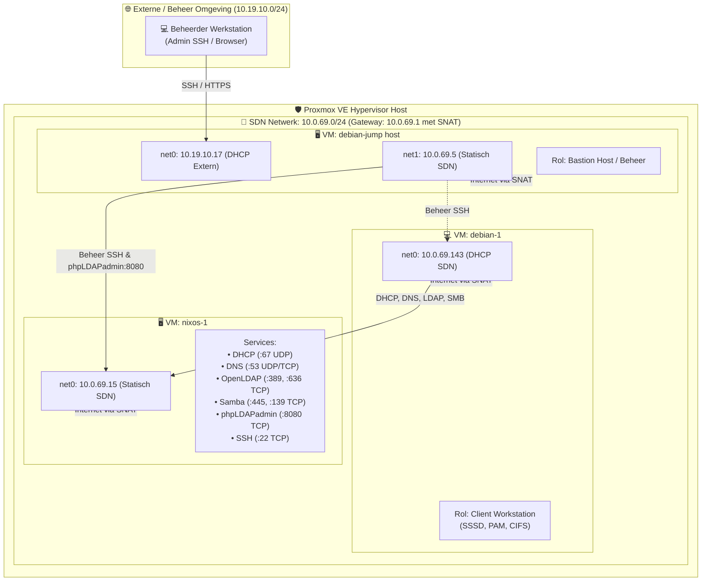

# Proxmox VE Firewall — Architectuur, Configuratie & Validatiehandleiding

Deze handleiding beschrijft de complete firewall-strategie voor het Linux Network Services lab binnen **Proxmox VE (PVE)**. Het document behandelt de huidige baseline (met de firewall uitgeschakeld), de stapsgewijze configuratie op cluster-, VM- en interface-niveau in PVE, en de verificatietesten om aan te tonen dat het netwerk optimaal beveiligd is volgens het *least privilege*-principe.

---

## 🗺️ Netwerktopologie & VM-Overzicht

In Proxmox VE draaien drie virtuele machines binnen een Software-Defined Network (**SDN Simple Zone**):



### 📋 VM Specificaties & IP-Tabel

| VM Naam | PVE Rol | Netwerkinterfaces & IP-adressen | Firewall Doelstelling |
| :--- | :--- | :--- | :--- |
| **`nixos-1`** | Centrale Server | `net0`: `10.0.69.15/24` (statisch) | Alleen labdiensten (DHCP, DNS, LDAP, SMB) openstellen voor SDN subnet. Beheerpoorten (`22` SSH, `8080` phpLDAPadmin) **uitsluitend** toegankelijk maken vanaf de Jump Host (`10.0.69.5`). Alle overige inkomende poorten blokkeren (DROP). |
| **`debian-1`** | Client VM | `net0`: `10.0.69.143/24` (dynamisch via DHCP van `nixos-1`) | Zuivere clientconfiguratie: alle uitgaande verbindingen toestaan (stateful tracking), inkomend alle ongeautoriseerde verbindingen blokkeren (DROP), behalve DHCP-replies, ICMP en optioneel beheer-SSH vanaf de Jump Host. |
| **`debian-jump host`** | Bastion / Jump Host | `net0`: `10.19.10.17` (extern netwerk via DHCP)<br>`net1`: `10.0.69.5` (statisch SDN netwerk) | Dient als gecontroleerde toegangspoort voor beheerders. Mag inkomend alleen SSH accepteren op het beheerinterface. Kan vanaf `10.0.69.5` alle beheertaken op de lab-VM's uitvoeren. |

> [!IMPORTANT]
> **SDN Netwerk Eigenschappen (`10.0.69.0/24`):**
> De Proxmox SDN gateway (`10.0.69.1`) verzorgt uitsluitend **SNAT (Source NAT)** voor uitgaand internetverkeer. Het SDN levert **geen** DNS of DHCP. Alle dynamische IP-toekenning en domeinnaamresolutie zijn de verantwoordelijkheid van `nixos-1` (`10.0.69.15`).

---

## 🔍 Fase 1: Huidige Situatie (Baseline — Firewall UIT in PVE)

Op dit moment staat de Proxmox VE firewall **volledig uitgeschakeld**. Ook binnen het besturingssysteem van NixOS staat de lokale firewall uit (`networking.firewall.enable = false`).

### Wat gebeurt er in deze situatie?

1. **Geen pakketfiltering op de virtuele bridge:** Alle netwerkpakketten tussen de VM's onderling en van/naar de gateway worden ongehinderd doorgelaten.
2. **Ongeautoriseerde toegang tot beheerinterfaces:** 
   - De webinterface van **phpLDAPadmin (poort `8080/TCP`)** is direct bereikbaar voor de gewone client `debian-1` (`10.0.69.143`). Een niet-geprivilegieerde gebruiker of aanvaller op de client kan inlogpogingen doen op de beheerconsole.
   - De **SSH service (poort `22/TCP`)** op `nixos-1` is direct bereikbaar vanaf `debian-1`.
3. **Poortgedrag bij gesloten poorten (`closed` vs `filtered`):**
   - Wanneer een poort niet in gebruik is (bijv. poort `80` of `3306`), reageert de Linux TCP/IP-stack van `nixos-1` direct met een **TCP RST (Reset)** vlag.
   - Een portscan (`nmap`) toont deze poorten als **`closed`**. Hierdoor kan een aanvaller binnen milliseconden de volledige poortstatus van de server in kaart brengen.
   - Zodra de PVE firewall actief is, worden niet-toegestane packets stilletjes genegeerd (**DROP**), waardoor `nmap` de status **`filtered`** (timeout) toont.

---

### 🧪 Baseline Testen (Vóór het inschakelen van de Firewall)

Voer deze commando's uit op **`debian-1`** (`10.0.69.143`):

#### 1. Installeer netwerkgereedschap op `debian-1`:
```bash
sudo apt update && sudo apt install -y nmap curl iputils-ping
```

#### 2. Voer een TCP poortscan uit naar de server:
```bash
nmap -Pn -p 22,53,80,139,389,445,636,3306,8080 10.0.69.15
```

**Verwacht baseline resultaat:**
```text
PORT     STATE  SERVICE
22/tcp   open   ssh           <-- VEILIGHEIDSRISICO: Open voor normale client!
53/tcp   open   domain
80/tcp   closed http          <-- Status 'closed' (TCP RST ontvangen: GEEN firewall actief!)
139/tcp  open   netbios-ssn
389/tcp  open   ldap
445/tcp  open   microsoft-ds
636/tcp  open   ldaps
3306/tcp closed mysql         <-- Status 'closed' (Geen firewall drop)
8080/tcp open   http-proxy    <-- VEILIGHEIDSRISICO: phpLDAPadmin bereikbaar voor client!
```

#### 3. Test toegang tot phpLDAPadmin vanaf de client:
```bash
curl -I http://10.0.69.15:8080
```
* **Resultaat:** Geeft direct `HTTP/1.1 200 OK` (of `302 Found`). Dit bewijst dat de beheerinterface momenteel onbeschermd openstaat voor de werkplek-VM.

---

## ⚙️ Fase 2: Proxmox VE Firewall Architectuur & Inschakelen

De Proxmox VE firewall werkt via `iptables`/`nftables` en `ebtables` direct op de Linux bridge en de virtual network interfaces (`tap` devices) van de hypervisor host. Dit biedt bescherming **vóórdat** netwerkverkeer de virtuele machine zelf bereikt.

Er zijn drie niveaus die allemaal ingeschakeld moeten zijn:

```
[ Datacenter Niveau ]  ──►  Firewall = Yes (Cluster-breed)
         │
[ VM Netwerkkaart ]    ──►  Hardware -> net0 -> Firewall = [X] (Aangevinkt!)
         │
[ VM Firewall Opties ] ──►  Firewall = Yes, Input Policy = DROP, Output Policy = ACCEPT
```

### Stap 1: Cluster / Datacenter Firewall Activeren
1. Navigeer in de Proxmox Web GUI naar **Datacenter** -> **Firewall** -> **Options**.
2. Dubbelklik op **Firewall** en zet deze op **Yes**.
3. (Optioneel) Laat **Input Policy** op `ACCEPT` en **Output Policy** op `ACCEPT` staan op Datacenter-niveau, zodat PVE hostbeheer en clustercommunicatie (Corosync poort 5405) niet worden verstoord.

### Stap 2: Interface Firewall Vlag Controleren (Cruciaal!)
> [!CAUTION]
> Als het vinkje `Firewall` op de virtuele netwerkkaart niet aanstaat, negeert Proxmox alle firewallregels voor die specifieke interface!

Controleer voor zowel `nixos-1`, `debian-1` als `debian-jump host`:
1. Ga naar **VM** -> **Hardware**.
2. Selecteer **Network Device (net0)** (en `net1` bij de jump host) en klik op **Edit**.
3. Zorg dat het selectievakje **Firewall** is **ingeschakeld (aangevinkt)**.
4. Klik op **OK**.

---

## 🛡️ Fase 3: Concrete Firewall Regels per VM

### 1. Server VM: `nixos-1` (`10.0.69.15`)

#### A. VM Firewall Options instellen:
Ga naar **`nixos-1`** -> **Firewall** -> **Options**:
- **Firewall:** `Yes`
- **Input Policy:** `DROP` *(Alles weigeren tenzij expliciet toegestaan)*
- **Output Policy:** `ACCEPT` *(Server mag uitgaande verbindingen maken naar internet/SDN)*
- **Log level in:** `nolog` (of `info` om gedropte pakketten te analyseren in de console)

#### B. Firewall Regels toevoegen (in volgorde):
Ga naar **`nixos-1`** -> **Firewall** -> **Add**:

| Nr | Direction | Action | Protocol | Dest. Port (`dport`) | Source IP | Toelichting & Waarom |
| :---: | :---: | :---: | :---: | :---: | :---: | :--- |
| **1** | **IN** | **ACCEPT** | `udp` | `67` | *(leeg)* | **DHCP Server:** Clients sturen een broadcast vanaf `0.0.0.0:68` naar poort 67. Bron mag **NIET** gefilterd worden op een subnet omdat een nieuwe client nog geen IP bezit! |
| **2** | **IN** | **ACCEPT** | `udp` | `53` | *(leeg)* | **DNS (UDP):** Standaard naamresolutie voor het lab. |
| **3** | **IN** | **ACCEPT** | `tcp` | `53` | *(leeg)* | **DNS (TCP):** Grote antwoorden, DNSSEC of zone transfers. |
| **4** | **IN** | **ACCEPT** | `tcp` | `389` | *(leeg)* | **OpenLDAP:** Authenticatieverzoeken vanaf de Debian client (SSSD). |
| **5** | **IN** | **ACCEPT** | `tcp` | `636` | *(leeg)* | **OpenLDAPS:** Beveiligde LDAP over SSL/TLS. |
| **6** | **IN** | **ACCEPT** | `tcp` | `445` | *(leeg)* | **Samba SMB:** Bestandsuitwisseling voor public en secured shares. |
| **7** | **IN** | **ACCEPT** | `tcp` | `139` | *(leeg)* | **NetBIOS Session:** Ondersteuning voor NetBIOS / WSDD service discovery. |
| **8** | **IN** | **ACCEPT** | `tcp` | `8080` | `10.0.69.5` | **phpLDAPadmin:** **STRIKT BEPERKT:** Alleen toegestaan vanaf de Debian Jump Host (`10.0.69.5`)! |
| **9** | **IN** | **ACCEPT** | `tcp` | `22` | `10.0.69.5` | **SSH Beheer:** **STRIKT BEPERKT:** Alleen beheerverbindingen vanaf de Debian Jump Host (`10.0.69.5`)! |
| **10** | **IN** | **ACCEPT** | `icmp` | *(leeg)* | *(leeg)* | **ICMP (Ping):** Voor netwerkdiagnostiek binnen het lab. |

> [!TIP]
> **Waarom Destination IP én Source IP leeg mogen blijven:**
> * **Destination IP:** Omdat deze firewallregels direct op de virtuele interface (`net0`) van de VM worden toegepast, is alle inkomende data al fysiek bestemd voor deze VM.
> * **Source IP:** Omdat `net0` exclusief verbonden is met het geïsoleerde SDN-netwerk (`10.0.69.0/24`), is het instellen van het subnet als bron overbodig. Alleen voor beheerfuncties (**SSH poort 22** en **phpLDAPadmin poort 8080**) stellen we een specifiek bron-IP in (`10.0.69.5`), zodat normale client-VM's geen toegang krijgen tot de beheerinterfaces.

---

### 2. Client VM: `debian-1` (`10.0.69.143`)

#### A. VM Firewall Options instellen:
Ga naar **`debian-1`** -> **Firewall** -> **Options**:
- **Firewall:** `Yes`
- **Input Policy:** `DROP` *(Geen ongevraagde inkomende verbindingen naar de client)*
- **Output Policy:** `ACCEPT` *(Client kan vrij verbindingen initiëren)*

#### B. Firewall Regels toevoegen:
Omdat de PVE firewall *stateful* is (via conntrack), worden antwoorden op uitgaand verkeer (zoals DNS-antwoorden of webpagina's) automatisch binnengelaten. Er zijn slechts minimale inkomende regels nodig:

| Nr | Direction | Action | Protocol | Port(s) | Source IP | Toelichting |
| :---: | :---: | :---: | :---: | :---: | :---: | :--- |
| **1** | **IN** | **ACCEPT** | `udp` | `68` | `10.0.69.15` | **DHCP Client:** Toestaan van DHCPOFFER en DHCPACK afkomstig van de server poort 67. |
| **2** | **IN** | **ACCEPT** | `tcp` | `22` | `10.0.69.5` | **SSH Beheer:** Alleen de Jump Host mag inloggen op de client voor configuratie. |
| **3** | **IN** | **ACCEPT** | `icmp` | *(leeg)* | *(leeg)* | **ICMP (Ping):** Ping toestaan voor netwerkdiagnostiek. |

---

### 3. Bastion VM: `debian-jump host` (`10.19.10.17` & `10.0.69.5`)

#### A. VM Firewall Options instellen:
Ga naar **`debian-jump host`** -> **Firewall** -> **Options**:
- **Firewall:** `Yes`
- **Input Policy:** `DROP`
- **Output Policy:** `ACCEPT`

#### B. Firewall Regels toevoegen:

| Nr | Direction | Action | Interface | Protocol | Port | Source IP | Toelichting |
| :---: | :---: | :---: | :---: | :---: | :---: | :---: | :--- |
| **1** | **IN** | **ACCEPT** | `net0` | `tcp` | `22` | *(Beheerders IP/Subnet of leeg)* | **SSH Inkomend:** Beheerder logt via het externe netwerk in op de Jump Host. |
| **2** | **IN** | **ACCEPT** | `net1` | `icmp` | *(leeg)* | *(leeg)* | **ICMP (Ping):** Bereikbaarheidstesten op de SDN interface. |

---

## 🧪 Fase 4: Verificatiestappen & Validatie (Na Inschakelen)

Voer de verificatie uit in twee delen om zowel de beveiliging als de toegankelijkheid aan te tonen:

### Testreeks A: Vanaf de Client VM (`debian-1` — `10.0.69.143`)

Log in op `debian-1` via de PVE console of via de jump host:

#### 1. Controleer toegestane labservices op `nixos-1`:
```bash
nmap -Pn -p 53,139,389,445,636 10.0.69.15
```
* **Verwacht resultaat:** Alle vijf de poorten tonen `open`:
  ```text
  PORT    STATE SERVICE
  53/tcp  open  domain
  139/tcp open  netbios-ssn
  389/tcp open  ldap
  445/tcp open  microsoft-ds
  636/tcp open  ldaps
  ```

#### 2. Negatieve test: Beveiligde & niet-toegestane poorten scannen:
```bash
nmap -Pn -p 22,80,3306,8080 10.0.69.15
```
* **Verwacht resultaat:** **Alle poorten tonen `filtered`!**
  ```text
  PORT     STATE    SERVICE
  22/tcp   filtered ssh
  80/tcp   filtered http
  3306/tcp filtered mysql
  8080/tcp filtered http-proxy
  ```
  > [!NOTE]
  > **Vergelijk met de baseline:**
  > Waar poort 80 en 3306 eerder `closed` teruggaven en poort 22 en 8080 `open` stonden, worden ze nu **stilletjes gedropt** door Proxmox VE. Dit voorkomt port reconnaissance en beschermt de admin interfaces.

#### 3. Negatieve test: phpLDAPadmin Web GUI blokkade testen:
```bash
curl -I --connect-timeout 3 http://10.0.69.15:8080
```
* **Verwacht resultaat:**
  `curl: (28) Connection timed out after 3001 milliseconds`
  (De client krijgt geen verbinding met de web GUI).

#### 4. Negatieve test: Directe SSH naar server vanaf client:
```bash
ssh -o ConnectTimeout=3 nixos@10.0.69.15
```
* **Verwacht resultaat:**
  `ssh: connect to host 10.0.69.15 port 22: Connection timed out`
  (Directe SSH vanaf de gewone client is succesvol geblokkeerd).

#### 5. Controleer dat centrale labdiensten blijven functioneren:
```bash
# DNS Test
dig @10.0.69.15 server.lab.lan +short

# LDAP Test
ldapsearch -x -H ldap://10.0.69.15:389 -b "dc=lab,dc=lan" -D "cn=readonly,dc=lab,dc=lan" -w readonlypassword uid

# Samba Test
smbclient -L //10.0.69.15 -N

# DHCP Renewal Test
dhclient -r ens18 && dhclient -v ens18
```
* **Verwacht resultaat:** Alle commando's slagen zonder fouten. De DHCP renewal toont dat DHCPOFFER en DHCPACK soepel passeren.

---

### Testreeks B: Vanaf de Jump Host (`debian-jump host` — `10.0.69.5`)

Log in op de jump host via SSH (`ssh <user>@10.19.10.17`):

#### 1. Test phpLDAPadmin toegang vanaf het geautoriseerde IP:
```bash
curl -I http://10.0.69.15:8080
```
* **Verwacht resultaat:**
  `HTTP/1.1 200 OK` (of `302 Found`). Vanaf de jump host (`10.0.69.5`) is de beheerconsole wel bereikbaar!

#### 2. Test SSH toegang naar de NixOS server:
```bash
ssh -o ConnectTimeout=3 nixos@10.0.69.15
```
* **Verwacht resultaat:** De SSH handshake slaagt en vraagt om authenticatie.

#### 3. Test SSH toegang naar de Debian client VM:
```bash
ssh -o ConnectTimeout=3 stijn@10.0.69.143
```
* **Verwacht resultaat:** De verbinding wordt direct opgebouwd.

