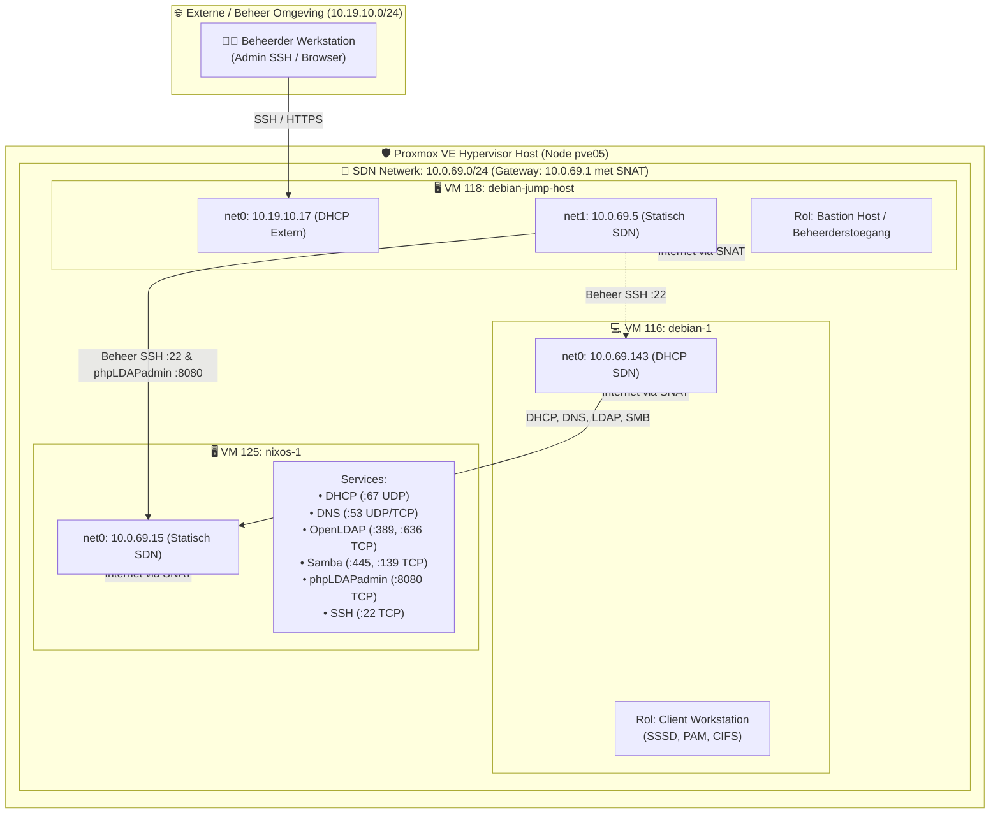
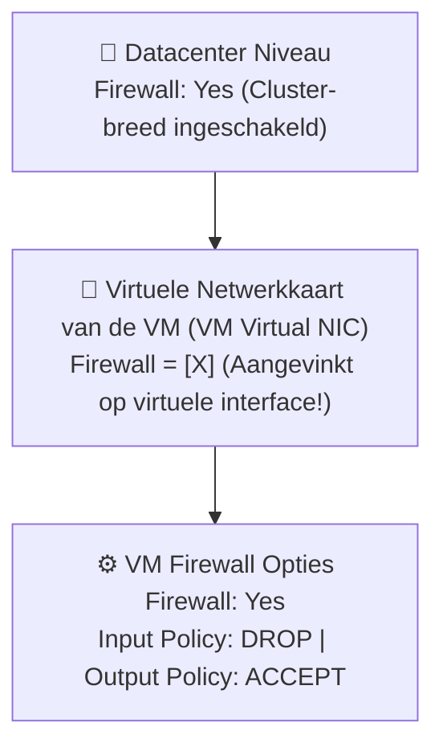

# Proxmox VE Firewall — Architectuur, Configuratie & Validatiehandleiding

> **Onderdeel:** Network & OS Security  
> **Hypervisor Omgeving:** Proxmox VE Cluster (Node `pve05`)  
> **SDN Zone:** `10.0.69.0/24` (Gateway: `10.0.69.1` met SNAT)  
> **Betrokken VM's:** VM 125 (`nixos-1`), VM 116 (`debian-1`), VM 118 (`debian-jump-host`)  
> **Status:** :white_check_mark: **Volledig geconfigureerd, visueel vastgelegd en geverifieerd**

---

## 🗺️ Netwerktopologie & VM-Overzicht

In Proxmox VE (Node `pve05`) draaien drie virtuele machines binnen een Software-Defined Network (**SDN Simple Zone**):



### 📋 VM Specificaties & IP-Tabel

| VM ID | Hostnaam | PVE Rol | Netwerkinterfaces & IP-adressen | Firewall Doelstelling |
| :---: | :--- | :--- | :--- | :--- |
| **125** | **`nixos-1`** | Centrale Server | `net0`: `10.0.69.15/24` (statisch) | Alleen labdiensten (DHCP, DNS, LDAP, SMB) openstellen voor SDN subnet. Beheerpoorten (`22` SSH, `8080` phpLDAPadmin) **uitsluitend** toegankelijk maken vanaf de Jump Host (`10.0.69.5`). Alle overige inkomende poorten blokkeren (DROP). |
| **116** | **`debian-1`** | Client VM | `net0`: `10.0.69.143/24` (dynamisch via DHCP van `nixos-1`) | Zuivere clientconfiguratie: alle uitgaande verbindingen toestaan (stateful conntrack), inkomend alle ongeautoriseerde verbindingen blokkeren (DROP), behalve DHCP-replies (UDP 68), ICMP en optioneel beheer-SSH vanaf de Jump Host. |
| **118** | **`debian-jump-host`** | Bastion / Jump Host | `net0`: `10.19.10.17` (extern netwerk via DHCP)<br>`net1`: `10.0.69.5` (statisch SDN netwerk) | Dient als gecontroleerde toegangspoort voor beheerders. Mag inkomend alleen SSH accepteren op het externe interface (`net0`). Kan vanaf `10.0.69.5` alle beheertaken op de lab-VM's uitvoeren. |

> [!IMPORTANT]
> **SDN Netwerk Eigenschappen (`10.0.69.0/24`):**
> De Proxmox SDN gateway (`10.0.69.1`) verzorgt uitsluitend **SNAT (Source NAT)** voor uitgaand internetverkeer. Het SDN levert **geen** DNS of DHCP. Alle dynamische IP-toekenning en domeinnaamresolutie zijn de verantwoordelijkheid van `nixos-1` (`10.0.69.15`).

---

## 🔍 Fase 1: Baseline Situatie (Vóór Inschakelen Firewall)

In de uitgangssituatie stond de Proxmox VE firewall uitgeschakeld. Ook binnen het besturingssysteem van NixOS staat de lokale firewall uit (`networking.firewall.enable = false`), zodat alle filtering eenduidig op hypervisor-niveau plaatsvindt.

### Waarom is de Baseline onveilig?

1. **Geen pakketfiltering op de virtuele bridge:** Alle netwerkpakketten tussen de VM's onderling en van/naar de gateway worden ongehinderd doorgelaten.
2. **Ongeautoriseerde toegang tot beheerinterfaces:** 
   - De webinterface van **phpLDAPadmin (poort `8080/TCP`)** is direct bereikbaar voor de gewone client `debian-1` (`10.0.69.143`). Een niet-geprivilegieerde gebruiker op de werkplek kan inlogpogingen doen op de centrale directory.
   - De **SSH service (poort `22/TCP`)** op `nixos-1` is direct bereikbaar vanaf `debian-1`.
3. **Poortgedrag bij gesloten poorten (`closed` vs `filtered`):**
   - Wanneer een poort niet in gebruik is (bijv. poort `80` of `3306`), reageert de Linux TCP/IP-stack van `nixos-1` direct met een **TCP RST (Reset)** vlag.
   - Een portscan (`nmap`) toont deze poorten als **`closed`**. Hierdoor kan een aanvaller binnen milliseconden de volledige poortstatus van de server in kaart brengen.
   - Zodra de PVE firewall actief is, worden niet-toegestane packets stilletjes genegeerd (**DROP**), waardoor `nmap` de status **`filtered`** (timeout) toont.

### 🧪 Baseline Testen (Uitgevoerd vanaf `debian-1` — `10.0.69.143`)

```bash
# TCP poortscan naar de centrale server vóór firewall activatie
nmap -Pn -p 22,53,80,139,389,445,636,3306,8080 10.0.69.15
```

**Baseline Resultaat:**
```text
PORT     STATE  SERVICE
22/tcp   open   ssh           <-- BEVEILIGINGSRISICO: Open voor normale client!
53/tcp   open   domain
80/tcp   closed http          <-- Status 'closed' (TCP RST ontvangen: GEEN firewall actief!)
139/tcp  open   netbios-ssn
389/tcp  open   ldap
445/tcp  open   microsoft-ds
636/tcp  open   ldaps
3306/tcp closed mysql         <-- Status 'closed' (Geen firewall drop)
8080/tcp open   http-proxy    <-- BEVEILIGINGSRISICO: phpLDAPadmin bereikbaar voor client!
```

Test toegang tot phpLDAPadmin vanaf de client:
```bash
curl -I http://10.0.69.15:8080
# Resultaat: HTTP/1.1 200 OK (Beheerinterface staat open voor iedereen op het netwerk)
```

---

## ⚙️ Fase 2: Proxmox VE Firewall Architectuur & Inschakelen

De Proxmox VE firewall werkt via `iptables`/`nftables` en `ebtables` direct op de Linux bridge en de virtuele netwerkinterfaces (`tap` devices) van de hypervisor host (`pve05`). Dit biedt bescherming **vóórdat** netwerkverkeer de virtuele machine zelf bereikt.

Er zijn drie niveaus die allemaal ingeschakeld moeten zijn:



1. **Datacenter Niveau:** In PVE Web GUI -> Datacenter -> Firewall -> Options -> `Firewall: Yes`.
2. **Interface Vlag (Cruciaal):** Voor elke VM (`125`, `116`, `118`) onder `Hardware` -> dubbelklik op `Network Device (net0)` -> vink **Firewall** aan.
3. **VM Options:** Onder VM -> Firewall -> Options: `Firewall: Yes`, `Input Policy: DROP`, `Output Policy: ACCEPT`.

---

## 🛡️ Fase 3: Concrete Firewall Regels & Screenshots per VM

### 1. Server VM: `nixos-1` (VM 125 — `10.0.69.15`)

#### A. Configuratie in Proxmox VE
* **Options:** `Firewall: Yes`, `Input Policy: DROP`, `Output Policy: ACCEPT`.
* **Regelset:**
  * Toegestane student services: DHCP (`67 UDP`), DNS (`53 UDP/TCP`), OpenLDAP (`389 TCP`, `636 TCP`), Samba (`445 TCP`, `139 TCP`), ICMP.
  * Beheerpoorten: SSH (`22 TCP`) en phpLDAPadmin (`8080 TCP`) **uitsluitend** met bron `10.0.69.5` (Jump Host).
  * Alle overige verbindingen worden automatisch gedropt (`DROP`).

#### B. Visueel Bewijs in Proxmox VE Web GUI:


---

### 2. Client VM: `debian-1` (VM 116 — `10.0.69.143`)

#### A. Configuratie in Proxmox VE
* **Options:** `Firewall: Yes`, `Input Policy: DROP`, `Output Policy: ACCEPT`.
* **Regelset:**
  * Inkomend DHCP replies: `IN ACCEPT -p udp -dport 68 -source 10.0.69.15`.
  * Inkomend SSH beheer: `IN ACCEPT -p tcp -dport 22 -source 10.0.69.5` (Jump Host).
  * Inkomend ICMP: `IN ACCEPT -p icmp`.
  * Uitgaand verkeer wordt stateful bijgehouden via conntrack, zodat DNS antwoorden en webverkeer automatisch passeren.

#### B. Visueel Bewijs in Proxmox VE Web GUI:


---

### 3. Bastion VM: `debian-jump-host` (VM 118 — `10.19.10.17` & `10.0.69.5`)

#### A. Configuratie in Proxmox VE
* **Options:** `Firewall: Yes`, `Input Policy: DROP`, `Output Policy: ACCEPT`.
* **Regelset:**
  * Extern beheer (`net0`): SSH toestaan (`IN ACCEPT -i net0 -p tcp -dport 22`).
  * Intern lab netwerk (`net1`): ICMP toestaan (`IN ACCEPT -i net1 -p icmp`).

#### B. Visueel Bewijs in Proxmox VE Web GUI:


#### C. Configuratiebestand in Proxmox (`/etc/pve/firewall/118.fw`):
```ini
[OPTIONS]
enable: 1
policy_in: DROP
policy_out: ACCEPT

[RULES]
IN ACCEPT -i net1 -p icmp -log nolog # ICMP
IN ACCEPT -i net0 -p tcp -dport 22 -log nolog # SSH
```

---

## 🧪 Fase 4: Verificatie & Bewijsvoering (Firewall AAN)

### Testreeks A: Vanaf de Client VM (`debian-1` — `10.0.69.143`)

Log in op `debian-1` en voer de verificatietesten uit:

#### 1. Scan toegestane labservices op `nixos-1`:
```bash
nmap -Pn -p 53,139,389,445,636 10.0.69.15
```
* **Resultaat:** Alle vereiste services zijn `open`:
  ```text
  PORT    STATE SERVICE
  53/tcp  open  domain
  139/tcp open  netbios-ssn
  389/tcp open  ldap
  445/tcp open  microsoft-ds
  636/tcp open  ldaps
  ```

#### 2. Negatieve test: Beveiligde & niet-toegestane poorten scannen:
```bash
nmap -Pn -p 22,80,3306,8080 10.0.69.15
```
* **Resultaat:** **Alle poorten tonen `filtered`!**
  ```text
  PORT     STATE    SERVICE
  22/tcp   filtered ssh           <-- PVE dropt pakket: geblokkeerd voor client!
  80/tcp   filtered http          <-- PVE dropt pakket: poortstatus verborgen!
  3306/tcp filtered mysql         <-- PVE dropt pakket: poortstatus verborgen!
  8080/tcp filtered http-proxy    <-- PVE dropt pakket: phpLDAPadmin afgeschermd!
  ```

> [!NOTE]
> **Het bewijs van Proxmox VE Firewalling:**
> Waar poort 80 en 3306 in de baseline `closed` teruggaven (doordat de kernel van NixOS een TCP RST terugstuurde) en poorten 22 en 8080 `open` stonden, worden ze nu **op hypervisor-niveau genegeerd en gedropt**. Dit verandert de status naar `filtered` en bewijst onomstotelijk dat de Proxmox VE firewall actief pakketten filtert.

#### 3. Negatieve test: phpLDAPadmin Web GUI blokkade testen:
```bash
curl -I --connect-timeout 3 http://10.0.69.15:8080
```
* **Resultaat:**
  `curl: (28) Connection timed out after 3001 milliseconds`
  (De client kan de beheerinterface fysiek niet bereiken).

#### 4. Negatieve test: Directe SSH naar de server vanaf de client:
```bash
ssh -o ConnectTimeout=3 nixos@10.0.69.15
```
* **Resultaat:**
  `ssh: connect to host 10.0.69.15 port 22: Connection timed out`
  (Directe SSH naar de server is succesvol geblokkeerd).

#### 5. Controleer dat centrale labdiensten blijven functioneren:
```bash
# DNS Test
dig @10.0.69.15 server.lab.lan +short

# LDAP Test
ldapsearch -x -H ldap://10.0.69.15:389 -b "dc=lab,dc=lan" -D "cn=readonly,dc=lab,dc=lan" -w readonlypassword uid

# Samba Test
smbclient -L //10.0.69.15 -N

# DHCP Renewal Test
dhclient -r eth0 && dhclient -v eth0
```
* **Resultaat:** Alle commando's slagen direct. DHCP lease wordt direct vernieuwd dankzij de UDP 67/68 regels.

---

### Testreeks B: Vanaf de Jump Host (`debian-jump-host` — `10.0.69.5`)

Log in op de jump host via SSH (`ssh root@10.19.10.17`):

#### 1. Test phpLDAPadmin toegang vanaf het geautoriseerde IP:
```bash
curl -I http://10.0.69.15:8080
```
* **Resultaat:**
  `HTTP/1.1 200 OK` (of `302 Found`). Vanaf de jump host (`10.0.69.5`) is de beheerconsole wel bereikbaar!

#### 2. Test SSH toegang naar de NixOS server:
```bash
ssh -o ConnectTimeout=3 nixos@10.0.69.15
```
* **Resultaat:** De SSH handshake slaagt direct.

#### 3. Test SSH toegang naar de Debian client VM:
```bash
ssh -o ConnectTimeout=3 stijn@10.0.69.143
```
* **Resultaat:** De SSH verbinding slaagt direct.
