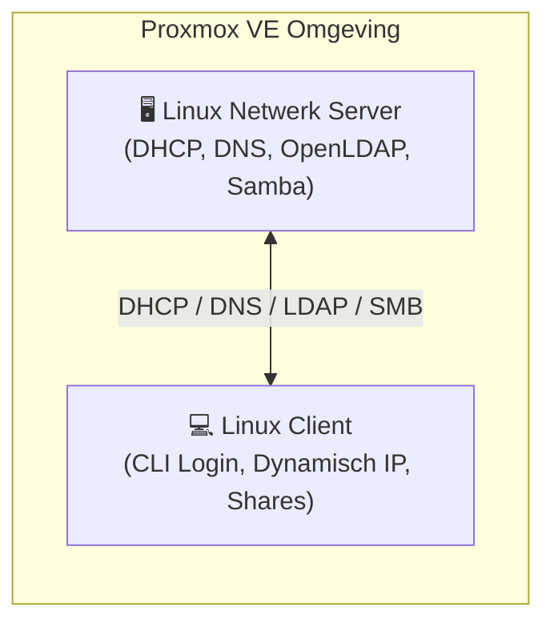

# Linux Network Services — Leerdoelen

Dit project documenteert de opzet en configuratie voor de leerdoelen van **Linux Network Services** en **Network & OS Security**. Zie ook [ARCHITECTURE.md](file:///home/stijn/Documents/git/LinuxNetworkServices-LearningGoals/ARCHITECTURE.md) voor een overzicht van wat waar draait.

---

## 🎯 Leerdoelen: Linux Network Services

Het doel is het realiseren van een Linux-netwerkomgeving bestaande uit een centrale server en gekoppelde client(s) met de volgende componenten: **DHCP**, **DNS**, **OpenLDAP** en **SMB**.

### 🏗️ Architectuuroverzicht



---

### 1. 🖥️ Linux Netwerk Server (Centrale Host)
Fungeert als centrale infrastructuur-host en draait de volgende kerndiensten:

- **DHCP**: Verzorgt de automatische IP-adrestoewijzing en netwerkconfiguratie voor clients.
- **DNS**: Biedt centrale naamresolutie binnen het netwerk.
- **OpenLDAP**: Centrale directory service voor gebruikersbeheer en authenticatie.
- **SMB (Samba)**: Centrale netwerkopslag en het delen van bestanden.

---

### 2. 💻 Linux Client
Een Linux-client die volledig geïntegreerd en afhankelijk is van de centrale server:

- **Dynamische configuratie**: Verkrijgt zijn netwerkinstellingen en IP-adres dynamisch via de DHCP-server.
- **Naamresolutie**: Resolved hostnames via de centrale DNS-server.
- **Centrale authenticatie**: Gebruikers kunnen via de CLI inloggen met netwerk-credentials die centraal via OpenLDAP worden gevalideerd.

---

## 🛡️ Network & OS Security

### Proxmox & Host-Based Firewalling

> [!NOTE]
> **Vraag:** *Hiervoor werd gezegd dat ik Proxmox host-based firewalling moet toepassen. Is dit iets wat ik kan doen met de 2 VM's van Linux Network Services?*

**Ja, dat kan uitstekend met deze 2 VM's!** Je kunt dit op twee complementaire manieren aanpakken:

1. **Proxmox VE Firewall (Hypervisor-niveau per VM):**
   - Proxmox beschikt over een ingebouwde firewall op VM-niveau (filtert direct op de virtuele netwerkinterface van de VM).
   - Hiermee kun je strikte inkomende en uitgaande firewallregels instellen per VM (bijv. poorten voor DHCP `67/68 UDP`, DNS `53 UDP/TCP`, OpenLDAP `389/636 TCP`, SMB `445 TCP` en beheer via SSH `22 TCP`).
2. **OS-level Firewall (Binnen het gast-OS):**
   - Host-based firewalling binnen de Linux VM's zelf configureren via tools zoals `ufw`, `nftables` of de declaratieven NixOS firewall (`networking.firewall`).

---

## 📚 Documentatie & Verificatie

- **Systeemarchitectuur & Service-indeling:** [ARCHITECTURE.md](ARCHITECTURE.md)
- **OpenLDAP & phpLDAPadmin Beheerdershandleiding:** [OPENLDAP_PHPLDAPADMIN_GUIDE.md](OPENLDAP_PHPLDAPADMIN_GUIDE.md)
- **Debian 13 Client VM Test- & Verificatiehandleiding:** [DEBIAN_CLIENT_TESTING_GUIDE.md](DEBIAN_CLIENT_TESTING_GUIDE.md)
- **Proxmox VE Firewall Architectuur- & Configuratiehandleiding:** [PROXMOX_FIREWALL_GUIDE.md](PROXMOX_FIREWALL_GUIDE.md)
- **DNS & DHCP Implementatieplan (Server VM 1):** [DNS_DHCP_PLAN.md](DNS_DHCP_PLAN.md)
- **NixOS Serverconfiguratie:** [NIX/proxmox-vm-1](NIX/proxmox-vm-1)

---
Original:
```
De leerdoelen van Linux Network Services:
    Hiervoor is gezegd dat ik een linux omgeving moet opzetten met SMB, DHCP, DNS, LDAP
    Concreet dus: (Voorstel van de AI)
    Een Linux Netwerk Server die fungeert als de centrale infrastructuur-host. Deze server draait de volgende kerndiensten:
    DHCP: Voor de automatische IP-toewijzing en netwerkconfiguratie van clients.
    DNS: Voor de centrale naamresolutie binnen het netwerk.
    OpenLDAP: Als de centrale directory service voor gebruikersbeheer en authenticatie.
    SMB (Samba): Voor centrale netwerkopslag en het delen van bestanden.
    Een Linux Client die volledig afhankelijk is van deze server. De client:
    Verkrijgt zijn netwerkinstellingen en IP-adres dynamisch via de DHCP-server.
    Resolved hostnames via de DNS-server.
    Staat toe dat gebruikers op de CLI inloggen met hun netwerk-credentials die centraal via OpenLDAP worden gevalideerd.

Network & OS Security:
    Hiervoor werd gezegd dat ik proxmox host-based firewalling moet toepassen. Is dit iets wat ik kan doen met de 2 VMS van Linux Network Services?
```