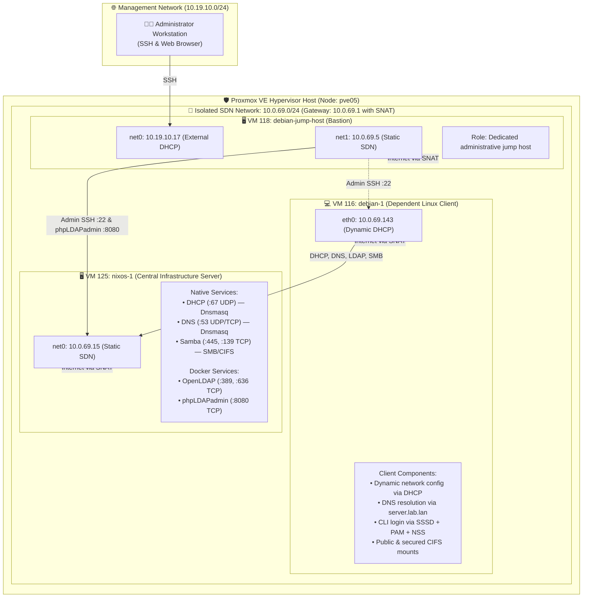
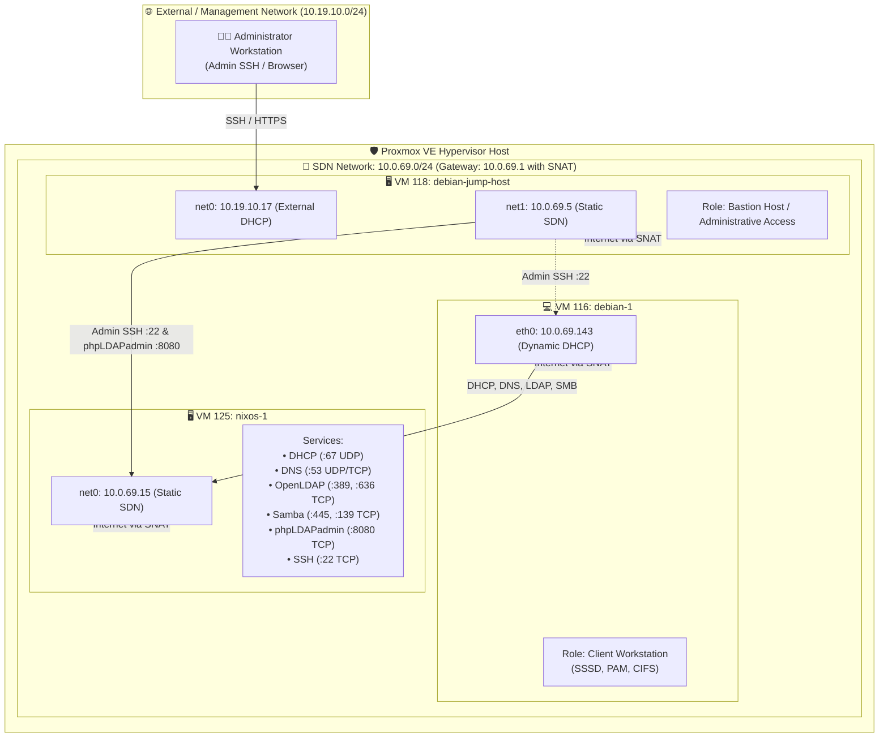
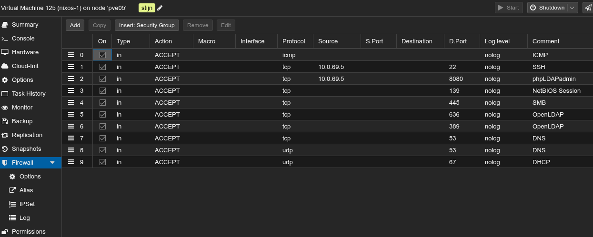
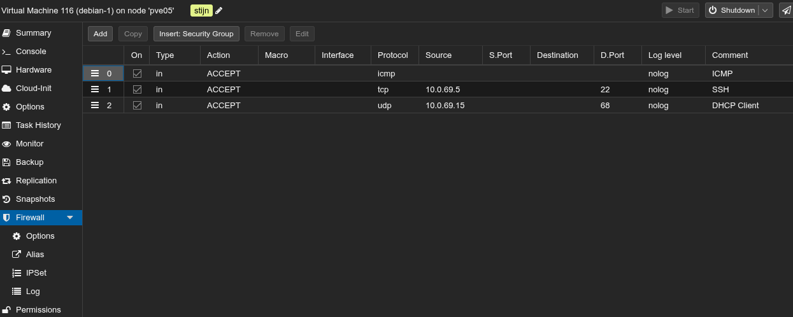
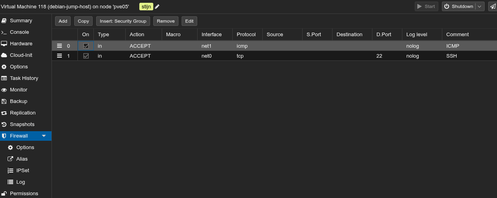

## 🗺️ System Architecture & Network Topology

The lab runs on Proxmox VE within a dedicated Software-Defined Network (**SDN Simple Zone**, subnet `10.0.69.0/24`). The SDN gateway `10.0.69.1` provides Source NAT (SNAT) for internet connectivity only. All internal network services (DHCP, DNS, LDAP, SMB) are hosted on the central NixOS server.



### VM Specifications & IP Assignment

| VM ID | Hostname | OS | Interfaces & IP | Role & Assignment Scope |
| :---: | :--- | :--- | :--- | :--- |
| **VM 125** | `nixos-1`<br>(`server.lab.lan`) | NixOS 24.11 | `net0`: `10.0.69.15/24` | **Central Infrastructure Server**: Hosts native Dnsmasq (DHCP/DNS), native Samba, and Docker containers for OpenLDAP and phpLDAPadmin. |
| **VM 116** | `debian-1`<br>(`client.lab.lan`) | Debian 13 (Trixie) | `net0`: `10.0.69.143/24` | **Dependent Client**: Obtains dynamic IP via DHCP, resolves names via VM 1, authenticates CLI sessions via OpenLDAP, and mounts Samba shares. |
| **VM 118** | `debian-jump-host` | Debian 12/13 | `net0`: `10.19.10.17` (external)<br>`net1`: `10.0.69.5` (SDN) | **Administrative Bastion**: Secure jump host. Exclusively permitted to access management services (SSH port 22 and phpLDAPadmin port 8080) on `nixos-1`. |

---

## 🛠️ Part 1: Central Server Implementation (Declarative NixOS)

Rather than manual imperative configuration, the central server (`nixos-1`) is declaratively provisioned with NixOS. Below are the actual configuration excerpts running on the server.

### 1. 📡 DHCP Server Configuration (`dnsmasq.nix`)
The DHCP server is implemented with **Dnsmasq**. It dynamically hands out IP addresses in the pool `10.0.69.100` – `10.0.69.200`, sets the default gateway to `10.0.69.1`, points DNS to `10.0.69.15`, and assigns the domain `lab.lan`.

*Source file: [`NIX/proxmox-vm-1/services/dnsmasq.nix`](NIX/proxmox-vm-1/services/dnsmasq.nix)*
```nix
services.dnsmasq = {
  enable = true;
  resolveLocalQueries = false;

  settings = {
    # Bind to server interfaces
    interface = [ "ens18" "lo" ];
    bind-interfaces = true;

    # Local domain definition
    domain = "lab.lan";
    local = [ "/lab.lan/" ];
    expand-hosts = true;

    # DHCP IP range, subnet mask, and 12-hour lease time
    dhcp-range = [ "10.0.69.100,10.0.69.200,255.255.255.0,12h" ];

    # DHCP Network Options (Gateway, DNS Server, Domain)
    dhcp-option = [
      "option:router,10.0.69.1"
      "option:dns-server,10.0.69.15"
      "option:domain-name,lab.lan"
    ];
    dhcp-authoritative = true;
  };
};
```
* **Client Behavior:** The Debian client VM boots up on interface `eth0`, broadcasts a DHCP request, and automatically receives `10.0.69.143/24` with default route `10.0.69.1` and nameserver `10.0.69.15`. Active leases are tracked server-side in `/var/lib/dnsmasq/dnsmasq.leases`.

---

### 2. 🔍 DNS Server Configuration (`dnsmasq.nix`)
DNS resolution handles both the internal private domain (`lab.lan`) with static A-records and upstream forwarding to Cloudflare DNS (`1.1.1.1`) for external internet queries.

*Source file: [`NIX/proxmox-vm-1/services/dnsmasq.nix`](NIX/proxmox-vm-1/services/dnsmasq.nix)*
```nix
    # Upstream DNS Forwarding
    no-resolv = true;
    server = [ "1.1.1.1" "1.0.0.1" ];
    domain-needed = true;
    bogus-priv = true;

    # Static A-Records within lab.lan
    address = [
      "/server.lab.lan/10.0.69.15"
      "/ldap.lab.lan/10.0.69.15"
      "/samba.lab.lan/10.0.69.15"
      "/client.lab.lan/10.0.69.25"
    ];
```
* **Client Behavior:** Queries for `server.lab.lan` resolve immediately to `10.0.69.15`. Due to the DHCP search domain `search lab.lan`, short names like `ping server` resolve transparently. Non-local queries (e.g. `google.com`) are forwarded upstream.

---

### 3. 🔐 OpenLDAP Directory Service & phpLDAPadmin (`openldap.nix`)
OpenLDAP (`slapd`) and the web management GUI (phpLDAPadmin) run in isolated Docker containers managed declaratively via NixOS OCI container options.

*Source file: [`NIX/proxmox-vm-1/services/openldap.nix`](NIX/proxmox-vm-1/services/openldap.nix)*
```nix
virtualisation.oci-containers = {
  backend = "docker";
  containers = {
    # OpenLDAP Directory Server
    openldap = {
      image = "osixia/openldap:1.5.0";
      autoStart = true;
      cmd = [ "--copy-service" ];
      ports = [ "389:389" "636:636" ];
      environment = {
        LDAP_ORGANISATION = "Lab LAN";
        LDAP_DOMAIN = "lab.lan";
        LDAP_BASE_DN = "dc=lab,dc=lan";
        LDAP_ADMIN_PASSWORD = "adminpassword";
        LDAP_READONLY_USER = "true";
        LDAP_READONLY_USER_USERNAME = "readonly";
        LDAP_READONLY_USER_PASSWORD = "readonlypassword";
      };
      volumes = [
        "/var/lib/openldap/data:/var/lib/ldap"
        "/var/lib/openldap/config:/etc/ldap/slapd.d"
        "/var/lib/openldap/bootstrap:/container/service/slapd/assets/config/bootstrap/ldif/custom"
      ];
    };

    # phpLDAPadmin Web GUI
    phpldapadmin = {
      image = "osixia/phpldapadmin:0.9.0";
      autoStart = true;
      ports = [ "8080:80" ];
      environment = {
        PHPLDAPADMIN_LDAP_HOSTS = "10.0.69.15";
        PHPLDAPADMIN_HTTPS = "false";
      };
      dependsOn = [ "openldap" ];
    };
  };
};
```

#### Directory Bootstrap Structure (`01-init.ldif`)
On first start, the tree is automatically seeded with organizational units (`people`, `groups`), the POSIX group `labusers` (GID 10001), and standard user accounts:

*Source file: [`NIX/proxmox-vm-1/services/ldap-bootstrap/01-init.ldif`](NIX/proxmox-vm-1/services/ldap-bootstrap/01-init.ldif)*
```ldif
# POSIX Group
dn: cn=labusers,ou=groups,dc=lab,dc=lan
objectClass: posixGroup
cn: labusers
gidNumber: 10001
memberUid: user1
memberUid: user2

# Test User 1
dn: uid=user1,ou=people,dc=lab,dc=lan
objectClass: inetOrgPerson
objectClass: posixAccount
uid: user1
cn: User One
uidNumber: 10001
gidNumber: 10001
userPassword: Password123!
loginShell: /bin/bash
homeDirectory: /home/user1
```

---

### 4. 📁 SMB File Server Configuration (`samba.nix`)
Samba provides network file storage with dual access levels: an anonymous public share and an authenticated secured share.

*Source file: [`NIX/proxmox-vm-1/services/samba.nix`](NIX/proxmox-vm-1/services/samba.nix)*
```nix
services.samba = {
  enable = true;
  settings = {
    global = {
      "workgroup" = "WORKGROUP";
      "server string" = "Lab Samba Server";
      "security" = "user";
      "map to guest" = "Bad User";
      "hosts allow" = "10.0.69. 127.0.0.1 localhost";
      "hosts deny" = "0.0.0.0/0";
    };

    # Public Share (Guest Read/Write)
    public = {
      "path" = "/var/shares/public";
      "browseable" = "yes";
      "read only" = "no";
      "guest ok" = "yes";
    };

    # Secured Share (Authenticated users only)
    secured = {
      "path" = "/var/shares/secured";
      "browseable" = "yes";
      "read only" = "no";
      "guest ok" = "no";
      "valid users" = "@sambashare nixos user1 user2";
      "force group" = "sambashare";
    };
  };
};
```
* **Credential Provisioning:** A systemd one-shot service (`samba-init-passwords.service`) automatically seeds the Samba password database (`passdb`) for `user1` and `user2` with `Password123!` upon deployment.

---

## 💻 Part 2: Linux Client Dependency & Authentication

The Debian 13 VM (`debian-1`, VM 116) acts as a client completely reliant on `nixos-1`:

1. **Network Interface (`eth0`):** Configured for DHCP. Automatically receives IP `10.0.69.143/24`, gateway `10.0.69.1`, and DNS `10.0.69.15`.
2. **DNS Resolution:** Lookups for `server.lab.lan`, `ldap.lab.lan`, `samba.lab.lan`, and internet domains resolve through VM 125.
3. **Centralized CLI Login (SSSD + PAM + NSS):**
   * Configured via `/etc/sssd/sssd.conf` binding to `ldap://server.lab.lan:389` with `cn=readonly,dc=lab,dc=lan`.
   * NSS (`libnss-sss`) makes LDAP users and groups immediately resolvable: `getent passwd user1` returns UID `10001`, GID `10001`, shell `/bin/bash`.
   * PAM integration (`libpam-sss` with `pam_mkhomedir.so`) allows users to execute `su - user1` (or SSH) using their central password (`Password123!`), automatically provisioning `/home/user1` upon first login.
4. **Network Storage:** Mounts `//server.lab.lan/public` as guest and `//server.lab.lan/secured` with authenticated credentials using `cifs-utils`.

> 📄 **Technical Client Setup Documentation:**  
> **[DEBIAN_CLIENT_SETUP.md](DEBIAN_CLIENT_SETUP.md)**

---

## 🛡️ Part 3: Proxmox Based Firewalling

### Proxmox VE Firewall Architecture



---

### Visual Evidence: Proxmox VE Web GUI Configurations

The firewall rules are configured and active on Proxmox node `pve05`:

#### 1. Server Firewall (`VM 125 — nixos-1`)
Exposes only student lab services to the SDN subnet. Sensitive management ports **SSH (`22/TCP`)** and **phpLDAPadmin (`8080/TCP`)** are restricted strictly to source IP `10.0.69.5`:



#### 2. Client Firewall (`VM 116 — debian-1`)
Inbound traffic is dropped by default. Stateful connection tracking permits outbound requests, while inbound rules allow DHCP replies (UDP 68 from `10.0.69.15`), SSH from the jump host, and ICMP:




#### 3. Bastion Jump Host Firewall (`VM 118 — debian-jump-host`)
Enables incoming SSH on external interface `net0` (`10.19.10.17`) and internal ICMP diagnostics on `net1` (`10.0.69.5`):



---

### Verification: Baseline vs. Hardened State

The difference between the baseline and the active Proxmox firewall demonstrates host-based hypervisor enforcement:

| Tested Service / Port | Phase A: Baseline (Firewall OFF) | Phase B: PVE Firewall ON | Security Implication & Proof |
| :--- | :--- | :--- | :--- |
| **Lab Services** (`53, 139, 389, 445, 636`) | `open` | `open` | All student services remain fully operational between client and server. |
| **phpLDAPadmin GUI** (`8080/TCP`) | `open` (HTTP 200 OK)<br>*Accessible to unprivileged client* | **`filtered` (Timeout after 3s)**<br>*Dropped for client* | Directory management is fully isolated from normal lab workstations. |
| **SSH Server Management** (`22/TCP`) | `open`<br>*Client can attempt logins* | **`filtered` (Timeout after 3s)**<br>*Dropped for client* | Direct attacks against the server shell are blocked at the hypervisor level. |
| **Closed / Unused Ports** | **`closed`** (NixOS kernel sends TCP RST) | **`filtered`** (PVE drops packets silently) | Prevents port reconnaissance and fingerprinting by attackers. |
| **Jump Host Access** (`10.0.69.5`) | `open` | `open` (HTTP 200 / SSH OK) | Administrator retains full, audited control via the bastion jump host. |
